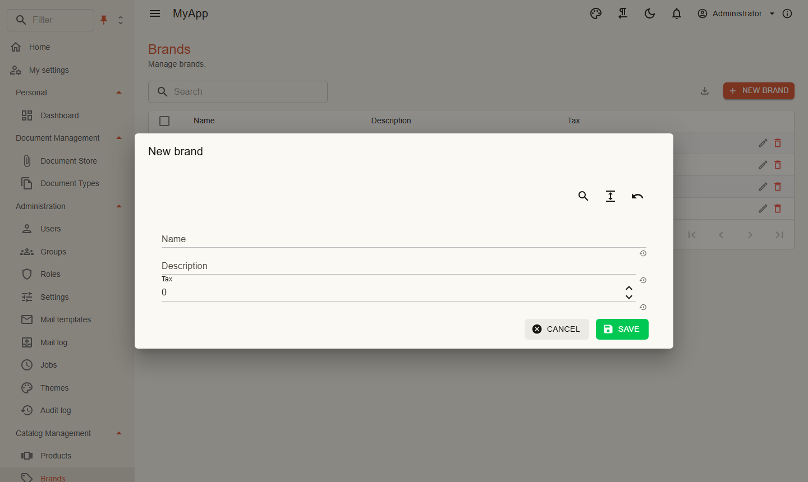

# Das erste Feature

Diese Seite baut die Marken (Brands) des Templates von Grund auf: eine Entity, ihre Tabelle, Berechtigungen, ein Command mit Validierung, einen HTTP-Endpunkt, ein OData-Set mit Facetten und eine Blazor-Seite. Jedes Beispiel ist echter Code aus dem Template.

## 1. Contracts

Berechtigungsnamen und DTOs liegen im Contracts-Projekt, weil der Blazor-Client sie ebenfalls braucht.

```csharp title="MyApp.Contracts/Catalog/CatalogPermissions.cs"
public static class CatalogPermissions
{
    public const string GroupName = "Catalog";

    public static class Brands
    {
        public const string View = "Catalog.Brands.View";
        public const string Create = "Catalog.Brands.Create";
        public const string Edit = "Catalog.Brands.Edit";
        public const string Delete = "Catalog.Brands.Delete";
    }
}
```

```csharp title="MyApp.Contracts/Catalog/BrandDto.cs"
public sealed record BrandDto(Guid Id, string Name, string? Description, decimal Tax);
```

```csharp title="MyApp.Contracts/Catalog/AddEditBrandRequest.cs"
public sealed class AddEditBrandRequest
{
    public string Name { get; set; } = string.Empty;

    public string? Description { get; set; }

    public decimal Tax { get; set; }
}
```

Der Request ist bewusst eine Klasse mit Settern: Der Bearbeitungsdialog bindet direkt daran.

## 2. Entity und Tabelle

```csharp title="MyApp.Catalog/Domain/Brand.cs"
[Realtime(CatalogPermissions.Brands.View)]
public sealed class Brand : AuditedEntity, IMultiTenant
{
    public required string Name { get; set; }

    public string? Description { get; set; }

    public decimal Tax { get; set; }

    public Guid TenantId { get; set; }
}
```

- `AuditedEntity` bringt `Id` (eine GUID Version 7), `CreatedAt`, `CreatedBy`, `ModifiedAt`, `ModifiedBy` mit. Die Werte werden beim Speichern gesetzt.
- `IMultiTenant` filtert Abfragen auf den Mandanten des aktuellen Benutzers und setzt `TenantId` beim Anlegen.
- `[Realtime]` meldet jede Änderung an Clients mit der Berechtigung, siehe [Realtime](../modules/realtime.md).

Module besitzen keinen eigenen `DbContext`. Sie tragen zu dem der App bei:

```csharp title="MyApp.Catalog/Persistence/CatalogModelContributor.cs"
internal sealed class CatalogModelContributor : IModelContributor
{
    public void Apply(ModelBuilder modelBuilder) =>
        modelBuilder.Entity<Brand>(brand =>
        {
            brand.ToTable("Brands", "app");
            brand.Property(b => b.Name).HasMaxLength(200);
            brand.Property(b => b.Tax).HasPrecision(9, 4);
            brand.HasIndex(b => new { b.TenantId, b.Name }).IsUnique();
        });
}
```

Die Migration entsteht im Infrastruktur-Projekt:

```bash
dotnet ef migrations add Brands --project src/MyApp.Infrastructure
```

## 3. Berechtigungen

```csharp title="MyApp.Catalog/Permissions/CatalogPermissionDefinitions.cs"
internal sealed class CatalogPermissionDefinitions : IPermissionDefinitionContributor
{
    public void Define(PermissionDefinitionContext context) =>
        context.Group(CatalogPermissions.GroupName, "Catalog")
            .Add(CatalogPermissions.Brands.View, "View brands")
            .Add(CatalogPermissions.Brands.Create, "Create brands", CatalogPermissions.Brands.View)
            .Add(CatalogPermissions.Brands.Edit, "Edit brands", CatalogPermissions.Brands.View)
            .Add(CatalogPermissions.Brands.Delete, "Delete brands", CatalogPermissions.Brands.View);
}
```

Das dritte Argument ist die übergeordnete Berechtigung: Wer im Rolleneditor *Create brands* bekommt, hat damit auch *View brands*.

## 4. Das Command

Ein Anwendungsfall besteht aus Request, Handler und, wenn es Eingaben gibt, einem Validator.

```csharp title="Features/Brands/Commands/AddEdit/AddEditBrandCommand.cs"
public sealed record AddEditBrandCommand(Guid? Id, AddEditBrandRequest Brand) : ICommand<Result<BrandDto>>, IInvalidatesCache
{
    public IReadOnlyList<string> CacheTags => [DashboardCache.Tag];
}
```

```csharp title="Features/Brands/Commands/AddEdit/AddEditBrandValidator.cs"
internal sealed class AddEditBrandValidator : AbstractValidator<AddEditBrandCommand>
{
    public AddEditBrandValidator()
    {
        RuleFor(c => c.Brand.Name).NotEmpty().MaximumLength(200);
        RuleFor(c => c.Brand.Tax).InclusiveBetween(0, 100);
    }
}
```

```csharp title="Features/Brands/Commands/AddEdit/AddEditBrandHandler.cs"
internal sealed class AddEditBrandHandler(CoworkeeDbContext db, IPermissionChecker permissions) : IHandler<AddEditBrandCommand, Result<BrandDto>>
{
    public async Task<Result<BrandDto>> HandleAsync(AddEditBrandCommand command, CancellationToken cancellationToken)
    {
        var required = command.Id is null ? CatalogPermissions.Brands.Create : CatalogPermissions.Brands.Edit;
        if (!await permissions.IsGrantedAsync(required, cancellationToken))
        {
            return Error.Forbidden("catalog.forbidden", "You may not do this.");
        }

        var name = command.Brand.Name.Trim();
        if (await db.Set<Brand>().AnyAsync(b => b.Name == name && b.Id != command.Id, cancellationToken))
        {
            return BrandErrors.NameTaken;
        }

        var brand = command.Id is { } id ? await db.Set<Brand>().SingleOrDefaultAsync(b => b.Id == id, cancellationToken) : Add(name);
        if (brand is null)
        {
            return BrandErrors.NotFound;
        }

        brand.Name = name;
        brand.Description = command.Brand.Description;
        brand.Tax = command.Brand.Tax;
        return brand.ToDto();
    }

    private Brand Add(string name)
    {
        var brand = new Brand { Name = name };
        db.Add(brand);
        return brand;
    }
}
```

Was der Handler nicht tut: Er ruft kein `SaveChangesAsync` auf, fängt keine Validierungsfehler ab und schreibt keine Logs. Das erledigt die [Pipeline](../fundamentals/messaging.md) um jeden Request herum. Braucht ein Request genau eine Berechtigung, reicht ein Attribut: `[RequiresPermission(CatalogPermissions.Brands.Delete)]` am Lösch-Command.

## 5. Endpunkt und OData-Set

```csharp title="MyApp.Catalog/Endpoints/BrandEndpoints.cs"
internal static class BrandEndpoints
{
    public static void MapBrandEndpoints(this IEndpointRouteBuilder app)
    {
        var brands = app.MapCoworkeeApi("/api/v1/brands").WithTags("Brands").RequireAuthorization();
        brands.MapPost("/", (AddEditBrandRequest body, IDispatcher d, CancellationToken ct) => d.SendAsync(new AddEditBrandCommand(null, body), ct).ToHttpResult());
        brands.MapPut("/{id:guid}", (Guid id, AddEditBrandRequest body, IDispatcher d, CancellationToken ct) => d.SendAsync(new AddEditBrandCommand(id, body), ct).ToHttpResult());
        brands.MapPost("/delete", (IdsRequest body, IDispatcher d, CancellationToken ct) => d.SendAsync(new DeleteBrandsCommand(body.Ids), ct).ToHttpResult());
    }
}
```

`ToHttpResult` macht aus einem `Result` ein `200`, `204` oder eine Problem-Details-Antwort mit passendem Status (`400` bei Validierung, `403`, `404`, `409`).

Fürs Lesen braucht es keinen Endpunkt. Registrieren Sie die Entity als OData-Set, und jede Tabelle bekommt Blättern, Sortieren, Filtern, Suche, Export und Facetten:

```csharp title="MyApp.Catalog/CatalogModule.cs"
[DependsOn(typeof(CoworkeeODataModule))]
public sealed class MyAppCatalogModule : CoworkeeModule, IWebModule
{
    public override void ConfigureServices(ModuleServiceContext context)
    {
        context.Services.AddMessagingFromAssembly(typeof(MyAppCatalogModule).Assembly);
        context.Services.AddSingleton<IModelContributor, CatalogModelContributor>();
        context.Services.AddSingleton<IPermissionDefinitionContributor, CatalogPermissionDefinitions>();
        context.Services.AddODataEntity<Brand>("Brands", CatalogPermissions.Brands.View);
    }

    public void ConfigureApplication(WebApplication app) => app.MapBrandEndpoints();
}
```

`GET /odata/Brands?$filter=contains(Name,'a')&$orderby=Name&$count=true` funktioniert jetzt für alle mit *View brands*.

## 6. Die Blazor-Seite

```razor title="MyApp.Web.Client/Pages/Catalog/Brands.razor"
@page "/catalog/brands"
@attribute [Authorize(Policy = PermissionPolicy.Prefix + CatalogPermissions.Brands.View)]

<PageHeader Title="Brands" Description="Manage brands." />
<RealtimeSubscription Topic="type:Brand" OnEvent="_ => _table.ReloadAsync()" />
<CoworkeeDataTable @ref="_table" T="BrandDto" EntitySet="Brands" SearchFields="SearchFields" MultiSelection="true" DescribeItem="b => b.Name"
                   CreatePermission="@CatalogPermissions.Brands.Create" EditPermission="@CatalogPermissions.Brands.Edit" DeletePermission="@CatalogPermissions.Brands.Delete"
                   OnCreate="CreateAsync" OnEdit="EditAsync" OnDelete="DeleteAsync">
    <Columns>
        <PropertyColumn Property="b => b.Name" />
        <PropertyColumn Property="b => b.Description" />
        <PropertyColumn Property="b => b.Tax" Format="0.##" />
    </Columns>
</CoworkeeDataTable>
```

```csharp title="MyApp.Web.Client/Pages/Catalog/Brands.razor.cs"
public partial class Brands
{
    private static readonly string[] SearchFields = [nameof(BrandDto.Name), nameof(BrandDto.Description)];
    private CoworkeeDataTable<BrandDto> _table = null!;

    [Inject] private ICatalogApi Api { get; set; } = null!;

    [Inject] private IDialogService Dialogs { get; set; } = null!;

    [Inject] private ISnackbar Snackbar { get; set; } = null!;

    private Task CreateAsync() => EditAsync(null, new AddEditBrandRequest());

    private Task EditAsync(BrandDto brand) =>
        EditAsync(brand.Id, new AddEditBrandRequest { Name = brand.Name, Description = brand.Description, Tax = brand.Tax });

    private async Task EditAsync(Guid? id, AddEditBrandRequest model)
    {
        if (await Dialogs.ShowEditAsync(id is null ? "New brand" : "Edit brand", model) is { } saved)
        {
            await Snackbar.RunAsync(() => Api.SaveBrandAsync(id, saved), "Brand saved");
        }
    }

    private Task DeleteAsync(IReadOnlyCollection<BrandDto> brands) => Snackbar.RunAsync(() => Api.DeleteBrandsAsync([.. brands.Select(b => b.Id)]));
}
```

{ .shot }

Schaltflächen, für die die Berechtigung fehlt, werden nicht gerendert. `ShowEditAsync` baut das Formular mit MudBlazor.Extensions aus dem Request-Typ; für Besonderes schreiben Sie einen eigenen Dialog wie `ProductDialog` im Template.

Zum Schluss der Navigationseintrag:

```csharp title="MyApp.Web.Client/Navigation/MyAppNavigation.cs"
internal sealed class MyAppNavigation : INavigationContributor
{
    public IEnumerable<CoworkeeNavItem> Items =>
    [
        new("Brands", "/catalog/brands", Icons.Material.Outlined.Sell, CatalogPermissions.Brands.View, Group: "Catalog Management"),
    ];
}
```

## Was Sie nicht schreiben mussten

Logging, Transaktionen, Antworten bei Validierungsfehlern, die Berechtigungsprüfung der Liste, Blättern und Filtern auf dem Server, CSV-Export, die Löschbestätigung, das Neuladen, wenn jemand anderes eine Marke ändert, das Audit. Das kommt aus den Paketen.
