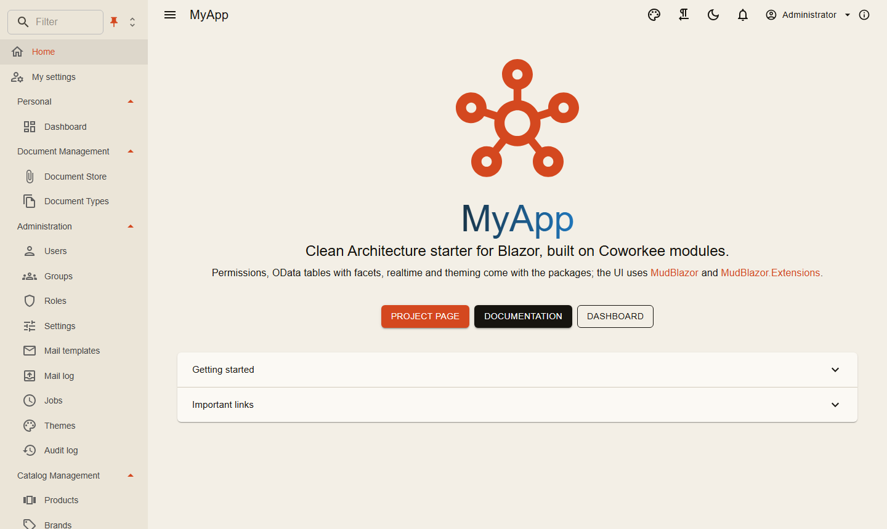
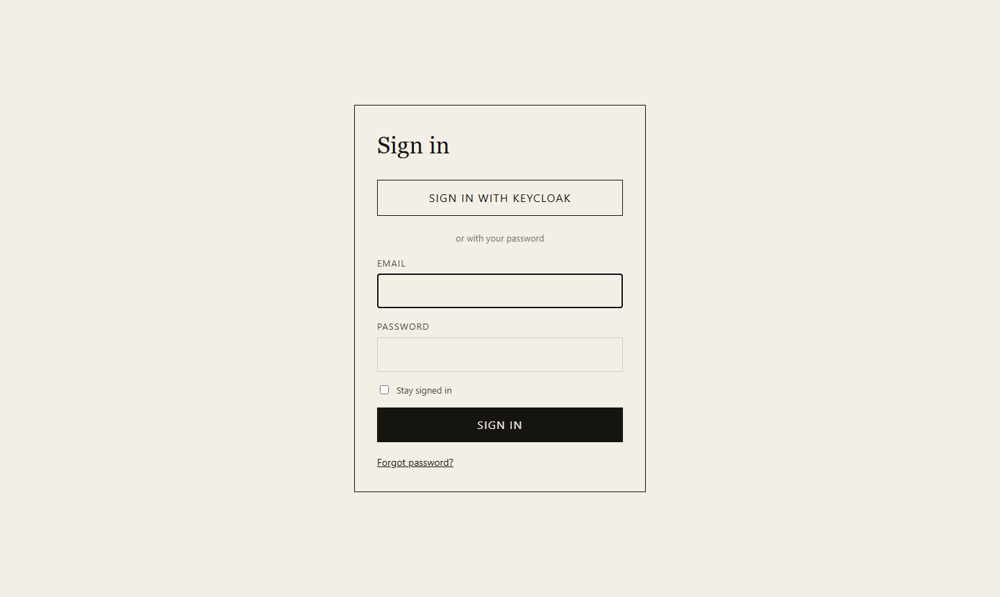

# Installation

## Voraussetzungen

- .NET SDK 10
- Docker (Postgres, Redis, Mailpit und bei Bedarf Keycloak laufen als Container)
- Eine IDE mit Aspire-Unterstützung oder einfach die `dotnet`-CLI

## Eine neue App in einer Minute

Die Coworkee-CLI legt eine vollständige Solution an, die die NuGet-Pakete nutzt: App-Host, API, Auth-Server, Blazor-Web-App, Migrationen, Beispielmodule.

```bash
dotnet tool install -g Coworkee.Cli
coworkee new Shop
cd Shop
coworkee run
```

Die Konsole zeigt die Adresse des Aspire-Dashboards; von dort öffnen Sie die Web-App. Die [CLI-Seite](cli.md) beschreibt die Optionen (`--no-samples`, `--keycloak`, …) und die übrigen Befehle.

Ohne CLI funktioniert dasselbe Template mit `dotnet new`:

```bash
dotnet new install Coworkee.Templates
dotnet new coworkee -n Shop
```

## Die Demo-Anwendung

Die [Coworkee-Demo-App](https://github.com/fgilde/Coworkee/tree/master) ist das vollständige Beispiel: Katalog, Dokumente, Dashboard, Administration, angelegte Benutzer und Keycloak.

```bash
git clone https://github.com/fgilde/Coworkee coworkee-demo
cd coworkee-demo
dotnet run --project src/MyApp.AppHost
```

{ .shot }

Der Migrations-Dienst spielt die Migrationen ein und legt die Benutzer an, bevor die anderen Dienste starten; ihre Passwörter stehen in `src/MyApp.Migrations/DemoSeed.cs`. Die Anmeldeseite bietet zusätzlich **Sign in with Keycloak** an; das Keycloak-Passwort ist der generierte Aspire-Parameter `myapp-keycloak-user-password` im Dashboard.

{ .shot }

## Von Grund auf mit NuGet

Was das Template anlegt, Schritt für Schritt. Alle Pakete beginnen mit `Coworkee.`; das Modulsystem zieht die Abhängigkeiten dessen nach, was Sie referenzieren. Halten Sie eine Version für alle in `Directory.Packages.props`:

```xml title="Directory.Packages.props"
<PropertyGroup>
  <ManagePackageVersionsCentrally>true</ManagePackageVersionsCentrally>
  <CoworkeeVersion>1.0.0</CoworkeeVersion>
</PropertyGroup>
<ItemGroup>
  <PackageVersion Include="Coworkee.Aspire" Version="$(CoworkeeVersion)" />
  <PackageVersion Include="Coworkee.AspNetCore" Version="$(CoworkeeVersion)" />
  <!-- one line per Coworkee package you use -->
</ItemGroup>
```

| Projekt | Pakete | Zweck |
|---|---|---|
| `Shop.Contracts` | `Coworkee.Contracts` | DTOs und Berechtigungsnamen für Server und Client |
| `Shop.Application` | `Coworkee.Application` | Commands, Queries, Handler |
| `Shop.Infrastructure` | `Coworkee.Infrastructure`, `Coworkee.Identity` und die gewünschten Fachmodule (`Coworkee.Theming`, `Coworkee.Mailing`, `Coworkee.Auditing`, `Coworkee.Localization`, `Coworkee.Chat`, `Coworkee.Ai`, …) | der Datenbankkontext und das Modul, das alle Module sammelt |
| `Shop.Api` | `Coworkee.AspNetCore` | HTTP-API und OData |
| `Shop.Auth` | `Coworkee.AuthServer` | Anmeldung, OpenID-Connect-Server |
| `Shop.Web` | `Coworkee.Bff` | liefert den Blazor-Client aus, hält die Tokens auf dem Server |
| `Shop.Web.Client` | `Coworkee.Client.Blazor` | die Blazor-WebAssembly-Oberfläche |
| `Shop.Migrations` | über `Shop.Infrastructure` | spielt Migrationen und Seed ein, bevor die Dienste starten |
| `Shop.AppHost` | `Coworkee.Aspire` | startet alles mit Postgres, Redis und Mailpit |

### Datenbank und Module

```csharp title="Shop.Infrastructure"
public sealed class ShopDbContext(DbContextOptions<ShopDbContext> options, ICurrentUser currentUser, IEnumerable<IModelContributor> contributors)
    : CoworkeeDbContext(options, currentUser, contributors);

[DependsOn(typeof(ShopApplicationModule), typeof(CoworkeeIdentityModule))]
public sealed class ShopInfrastructureModule : CoworkeeModule
{
    public const string ConnectionStringName = "shop";

    public override void ConfigureServices(ModuleServiceContext context) =>
        context.Services.AddCoworkeeDbContext<ShopDbContext>((provider, options) => options.UseNpgsql(
            provider.GetRequiredService<IConfiguration>().GetConnectionString(ConnectionStringName),
            npgsql => npgsql.MigrationsHistoryTable("__EFMigrationsHistory", "cw")));
}

// every module that owns tables, so the migrations cover all of them
[DependsOn(typeof(ShopInfrastructureModule), typeof(CoworkeeAuthStoreModule), typeof(CoworkeeThemingModule), typeof(CoworkeeMailingModule))]
public sealed class ShopDatabaseModule : CoworkeeModule;
```

Eine Design-Time-Factory lässt `dotnet ef` den Kontext bauen: sie ruft `services.AddCoworkeeModules<ShopDatabaseModule>(configuration)` auf und holt `ShopDbContext`. Dann `dotnet ef migrations add Initial --project src/Shop.Infrastructure` (oder `coworkee migrations add Initial`).

### Die Hosts

```csharp title="Shop.Api/Program.cs"
var builder = WebApplication.CreateBuilder(args);
builder.AddServiceDefaults();
builder.AddCoworkee<ShopApiModule>();

var app = builder.Build();
app.MapDefaultEndpoints();
app.UseCoworkee();
app.Run();

[DependsOn(typeof(ShopDatabaseModule))]
public sealed class ShopApiModule : CoworkeeModule
{
    public override void ConfigureServices(ModuleServiceContext context) =>
        context.Services.AddCoworkeeApiAuthentication(context.Configuration, "shop_api");
}
```

```csharp title="Shop.Auth/Program.cs"
var builder = WebApplication.CreateBuilder(args);
builder.AddServiceDefaults();
builder.AddCoworkee<ShopAuthModule>();

var app = builder.Build();
app.MapDefaultEndpoints();
app.UseCoworkee();
app.Run();

[DependsOn(typeof(ShopInfrastructureModule), typeof(CoworkeeAuthServerModule))]
internal sealed class ShopAuthModule : CoworkeeModule;
```

```csharp title="Shop.Web/Program.cs"
var builder = WebApplication.CreateBuilder(args);
builder.AddServiceDefaults();
builder.AddCoworkeeBff();
builder.Services.AddRazorComponents().AddInteractiveWebAssemblyComponents();

var app = builder.Build();
app.MapDefaultEndpoints();
app.UseStaticFiles();
app.UseAntiforgery();
app.MapCoworkeeBff();
app.MapStaticAssets();
app.MapRazorComponents<App>()
    .AddInteractiveWebAssemblyRenderMode()
    .AddAdditionalAssemblies(typeof(Shop.Web.Client._Imports).Assembly, typeof(CoworkeeClientOptions).Assembly);
app.Run();
```

```csharp title="Shop.Web.Client/Program.cs"
var builder = WebAssemblyHostBuilder.CreateDefault(args);
builder.Services.AddCoworkeeClient(new Uri(builder.HostEnvironment.BaseAddress), options =>
{
    options.AppTitle = "Shop";
    options.AppLogo = "logo.svg";
});
var host = builder.Build();
await host.Services.InitializeCoworkeeClientAsync();
await host.RunAsync();
```

Die `Routes.razor` des Clients nutzt `CoworkeeLayout` als Standardlayout und gibt dem Router die Assembly `Coworkee.Client.Blazor` mit; so sind Shell, Kontoseite und Administrationsseiten da.

```csharp title="Shop.AppHost/AppHost.cs"
var builder = DistributedApplication.CreateBuilder(args);
var app = builder.AddCoworkeeApp("shop");

app.AddMigrations<Projects.Shop_Migrations>();
app.AddAuthServer<Projects.Shop_Auth>();
app.AddApi<Projects.Shop_Api>();
app.AddWeb<Projects.Shop_Web>();

builder.Build().Run();
```

`AddCoworkeeApp` legt Postgres an und gibt jedem Dienst die Infrastruktur, die seine Coworkee-Pakete brauchen, siehe [Aspire](../hosting/aspire.md).

[Pakete und Namespaces](../reference/packages.md) listet, was in welchem Paket steckt.

## Weiter

[Aufbau der Solution](solution-structure.md) erklärt die Projekte, [Das erste Feature](first-feature.md) legt eine neue Entity von vorne bis hinten an.
