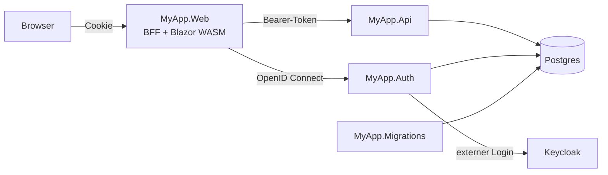

# Aufbau der Solution

Das Template trennt, was wo läuft. Jeder Dienst ist ein kleiner Host, der Module zusammensetzt; der fachliche Code liegt in Modulprojekten.



| Projekt | Aufgabe |
|---|---|
| `MyApp.AppHost` | Aspire-AppHost, siehe [Aspire-AppHost](../hosting/aspire.md) |
| `MyApp.Migrations` | Spielt die EF-Core-Migrationen ein, legt Benutzer, Rollen und Beispieldaten an und beendet sich |
| `MyApp.Auth` | OpenID-Connect-Server mit den Anmeldeseiten (`Coworkee.AuthServer`) |
| `MyApp.Api` | Die HTTP-API: Modul-Endpunkte, OData, SignalR-Hub, Hangfire-Dashboard |
| `MyApp.Web` | Liefert den WebAssembly-Client aus und ist Backend for Frontend (`Coworkee.Bff`) |
| `MyApp.Web.Client` | Blazor WebAssembly: Seiten, Dialoge, Navigation |
| `MyApp.Contracts` | DTOs, Requests und Berechtigungsnamen für Server und Client |
| `MyApp.Catalog`, `MyApp.Documents` | Fachmodule: Domäne, Persistenz, Features, Endpunkte |
| `MyApp.Application` | Schnittstellen, die Module teilen, etwa die Dashboard-Zähler |
| `MyApp.Infrastructure` | `MyAppDbContext`, Migrationen und das Modul, das die Datenbank zusammenführt |

## In einem Fachmodul

```text
MyApp.Catalog/
  CatalogModule.cs
  Domain/                Brand.cs, Product.cs
  Persistence/           CatalogModelContributor.cs
  Permissions/           CatalogPermissionDefinitions.cs
  Features/
    Brands/
      Commands/AddEdit/  AddEditBrandCommand.cs, ...Handler.cs, ...Validator.cs
      Commands/Delete/
      Queries/GetById/
      BrandErrors.cs, BrandMapping.cs
  Endpoints/             BrandEndpoints.cs
```

Ein Typ pro Datei, der Anwendungsfall steckt im Ordnernamen. Für Listen braucht es keine Query: Das OData-Set der Entity bedient die Tabellen.

## Wie die Hosts starten

Jeder Server-Host besteht aus denselben drei Zeilen; das Root-Modul bestimmt, was der Host enthält.

```csharp title="MyApp.Api/Program.cs"
var builder = WebApplication.CreateBuilder(args);
builder.AddServiceDefaults();
builder.AddCoworkee<MyAppApiModule>();

var app = builder.Build();
app.MapDefaultEndpoints();
app.UseCoworkee();
app.Run();
```

```csharp title="MyApp.Auth/Program.cs"
[DependsOn(typeof(MyAppInfrastructureModule), typeof(CoworkeeAuthServerModule))]
internal sealed class MyAppAuthModule : CoworkeeModule;
```
