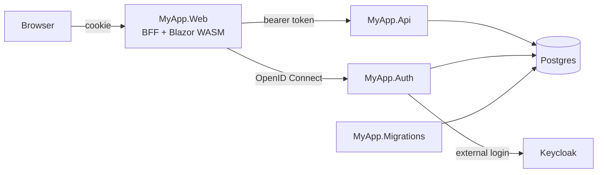

# Solution structure

The template separates what runs where. Every service is a small host that composes modules; the feature code lives in module projects.



| Project | Role |
|---|---|
| `MyApp.AppHost` | Aspire app host, see [Aspire app host](../hosting/aspire.md) |
| `MyApp.Migrations` | Applies EF Core migrations, seeds users, roles and sample data, then exits |
| `MyApp.Auth` | OpenID Connect server with the sign-in pages (`Coworkee.AuthServer`) |
| `MyApp.Api` | The HTTP API: module endpoints, OData, SignalR hub, Hangfire dashboard |
| `MyApp.Web` | Hosts the WebAssembly client and acts as backend for frontend (`Coworkee.Bff`) |
| `MyApp.Web.Client` | Blazor WebAssembly: pages, dialogs, navigation |
| `MyApp.Contracts` | DTOs, requests and permission names shared by server and client |
| `MyApp.Catalog`, `MyApp.Documents` | Feature modules: domain, persistence, features, endpoints |
| `MyApp.Application` | Interfaces modules share, for example the dashboard counts |
| `MyApp.Infrastructure` | `MyAppDbContext`, migrations and the module that ties the database together |

## Inside a feature module

```text
MyApp.Catalog/
  CatalogModule.cs
  Domain/                Brand.cs, Product.cs
  Persistence/           CatalogModelContributor.cs
  Permissions/           CatalogPermissionDefinitions.cs
  Features/
    Brands/
      Commands/AddEdit/  AddEditBrandCommand.cs, ...Handler.cs, ...Validator.cs
      Commands/Delete/
      Queries/GetById/
      BrandErrors.cs, BrandMapping.cs
  Endpoints/             BrandEndpoints.cs
```

One type per file, the use case in the folder name. Lists do not need a query: the OData set of the entity serves the tables.

## How the hosts start

Every server host has the same three lines; the root module decides what the host contains.

```csharp title="MyApp.Api/Program.cs"
var builder = WebApplication.CreateBuilder(args);
builder.AddServiceDefaults();
builder.AddCoworkee<MyAppApiModule>();

var app = builder.Build();
app.MapDefaultEndpoints();
app.UseCoworkee();
app.Run();
```

```csharp title="MyApp.Auth/Program.cs"
[DependsOn(typeof(MyAppInfrastructureModule), typeof(CoworkeeAuthServerModule))]
internal sealed class MyAppAuthModule : CoworkeeModule;
```
