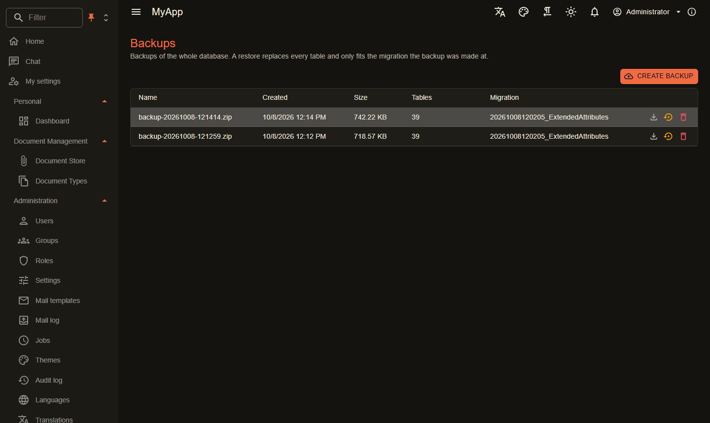

# Database backups

`Coworkee.Backup` saves the whole database as one zip in the [file storage](storage.md) and restores it.

{ .shot }

```csharp
[DependsOn(typeof(CoworkeeBackupModule))]
public sealed class MyAppDatabaseModule : CoworkeeModule;
```

- Every table of the model is written with Postgres `COPY ... (FORMAT BINARY)`; a manifest records the tables and the last applied migration.
- A restore replaces every table in one transaction. It refuses a backup made at another migration or with other tables.
- Caches are cleared after a restore.
- Backups hold every organisation, so only users of the system organisation with `Backups.Manage` see them. The admin page is `/admin/backups`.

| Endpoint | |
|---|---|
| `GET /api/v1/backups` | list |
| `POST /api/v1/backups` | create |
| `GET /api/v1/backups/{id}/download` | zip |
| `POST /api/v1/backups/{id}/restore` | restore |
| `DELETE /api/v1/backups/{id}` | delete |

!!! warning "Database rights"
    The restore loads tables with `session_replication_role = replica`, which skips foreign key checks while tables load in any order. The database user needs the right to set it (superuser, as in the Aspire setup, or a role with that right).

The table `cw.DatabaseBackups` itself is not part of a backup, so the list survives a restore.
