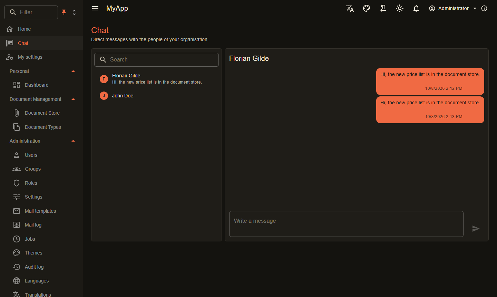

# Chat

`Coworkee.Chat` adds direct messages between the people of an organisation. New messages reach sender and recipient over the [realtime hub](realtime.md) on their `user:{id}` topic, so every open tab updates at once.

{ .shot }

```csharp
[DependsOn(typeof(CoworkeeChatModule))]
public sealed class MyAppDatabaseModule : CoworkeeModule;
```

- Page `/chat` for users with `Chat.Use`: people of the organisation with last message and unread count, the conversation, Enter sends.
- Messages are tenant-scoped; a message to someone outside the organisation is rejected.
- The assistant can read contacts and conversations and send messages, as the signed-in user ([AI tools](ai.md)).

| Endpoint | |
|---|---|
| `GET /api/v1/chat/contacts` | people with last message and unread count |
| `GET /api/v1/chat/conversations/{userId}?before=` | 50 messages, newest last |
| `POST /api/v1/chat/conversations/{userId}` | send `{ "text": "..." }` |
| `POST /api/v1/chat/conversations/{userId}/read` | mark the person's messages read |

Live messages in your own component:

```csharp
await realtime.SubscribeAsync(RealtimeTopics.User(me), envelope =>
{
    if (envelope.Type == ChatEvents.Message) { /* envelope.Payload is a ChatMessageDto */ }
});
```
