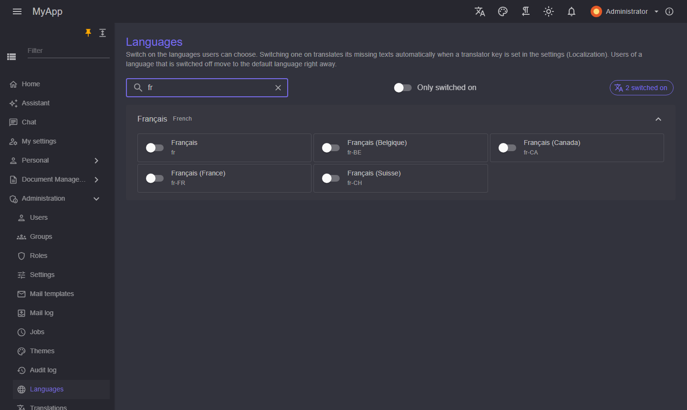

# Lokalisierung

`Coworkee.Localization` hält Sprachen und Übersetzungen in der Datenbank und liefert die Texte jedes Moduls als eingebettetes JSON mit.

```csharp
[DependsOn(typeof(CoworkeeLocalizationModule))]
public sealed class MyAppDatabaseModule : CoworkeeModule
{
    public override void ConfigureServices(ModuleServiceContext context) =>
        context.Services.AddSingleton<ILocalizationResourceContributor, MyAppTexts>();
}

internal sealed class MyAppTexts : ILocalizationResourceContributor
{
    public void Define(LocalizationResourceContext context) => context.AddEmbeddedJson(typeof(MyAppTexts).Assembly);
}
```

Schlüssel sind die englischen Texte. Ein Modul bettet `Localization/{culture}.json` ein:

```json title="Localization/de.json"
{
  "Brands": "Marken",
  "Delete {0}? This cannot be undone.": "{0} löschen? Das lässt sich nicht rückgängig machen."
}
```

```xml
<EmbeddedResource Include="Localization\*.json" />
```

## Im Client

`CoworkeeLocalizer` übersetzt in Seiten und Komponenten; fehlende Schlüssel fallen auf den Schlüssel zurück und werden an den Server gemeldet, wo sie unter *Übersetzungen* auftauchen.

```razor
@inject CoworkeeLocalizer L
<MudButton>@L["Save"]</MudButton>
<MudText>@L["Delete {0}? This cannot be undone.", brand.Name]</MudText>
```

Die Sprache wählt der Benutzer in der App-Leiste. Auch die Texte von MudBlazor (Pager, Filter, Dialoge) werden übersetzt. Die Kultur wird vor dem ersten Rendern gesetzt:

```csharp title="Program.cs"
var host = builder.Build();
await host.Services.InitializeCoworkeeClientAsync();
await host.RunAsync();
```

## Verwaltung

- *Sprachen* (`/admin/languages`): alle Kulturen, nach Sprache gruppiert, mit einem Schalter. Beim Einschalten werden fehlende Texte mit dem Azure AI Translator übersetzt, wenn `Localization.TranslatorKey` (und `Localization.TranslatorRegion`) in den Einstellungen gesetzt sind; ein Knopf übersetzt später noch Fehlendes. Der Stern markiert die Standardsprache, die sich nicht abschalten lässt.

{ .shot }
- *Übersetzungen* (`/admin/translations`): jeder Schlüssel mit Modultext und bearbeitetem Text je Sprache. Bearbeitungen gewinnen gegen die Modultexte.

Beides braucht `Localization.Manage`.

Jede Änderung erreicht alle Clients sofort (Realtime-Topic `global:localization`): sie laden ihre Texte neu, und Benutzer, deren Sprache abgeschaltet wurde, wechseln mit kurzem Hinweis zur Standardsprache.
