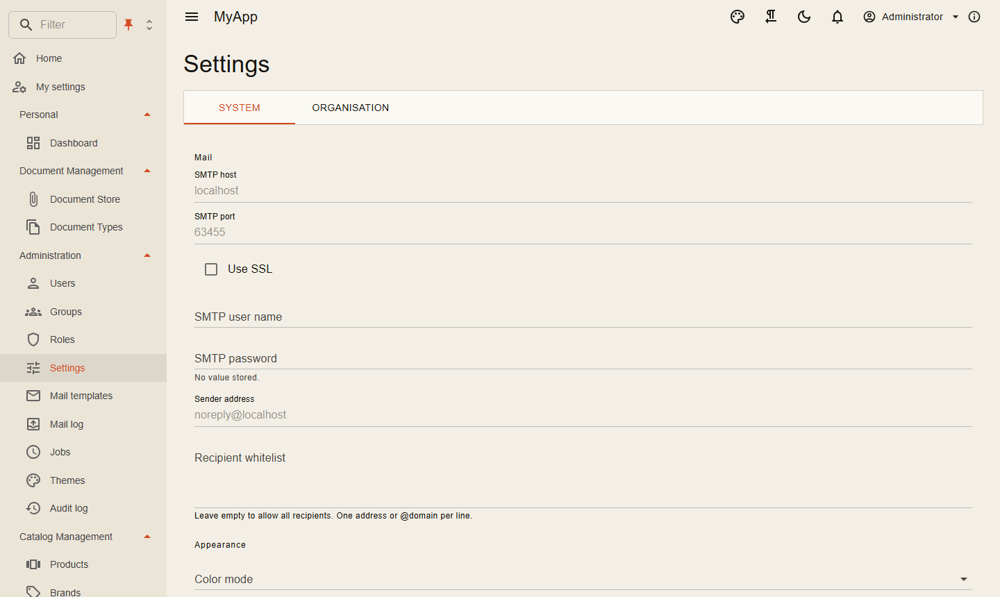

# Einstellungen und App-Konfiguration

Coworkee kennt zwei Arten von Konfiguration, die Administratoren zur Laufzeit ändern.

| | Einstellungen | App-Konfiguration |
|---|---|---|
| Für | einzelne Werte pro Installation, Mandant oder Benutzer (SMTP-Host, Theme, Registrierung an/aus) | eine typisierte Options-Klasse der App (Grenzen, Schalter, Integrationen) |
| Definiert durch | `ISettingDefinitionContributor` | eine C#-Klasse, optional aus JSON erzeugt |
| Gespeichert in | Einstellungstabelle, Geheimnisse verschlüsselt | `cw.ConfigurationEntries`, gelesen über `IConfiguration` |
| Gelesen mit | `ISettingProvider` | `IOptionsMonitor<T>` |
| Admin-Seite | Einstellungen, Tabs System und Organisation | Einstellungen, ein Tab pro Klasse (nur System-Mandant) |

## Einstellungen

```csharp
internal sealed class MailSettingDefinitions : ISettingDefinitionContributor
{
    public void Define(SettingDefinitionContext context) =>
        context.Group("Mail", "Mail")
            .Add("Mail.Smtp.Host", "SMTP host", SettingType.String, [SettingScope.Global])
            .Add("Mail.Smtp.Port", "SMTP port", SettingType.Int, [SettingScope.Global], defaultValue: "25")
            .Add("Mail.Smtp.Password", "SMTP password", SettingType.Secret, [SettingScope.Global]);
}
```

Typen sind `String`, `Text`, `Bool`, `Int`, `Secret` und `Choice`; Gültigkeitsbereiche `Global`, `Tenant` und `User`. Der spezifischste Wert gewinnt. Geheimnisse werden mit ASP.NET Core Data Protection verschlüsselt und nie an den Client geschickt; Einstellungen mit `visibleToClient: true` schon.

```csharp
var allowed = await settings.GetAsync<bool>(AccountSettings.AllowRegistration, ct);
```

Standardwerte können auch aus der Konfiguration kommen: `Coworkee:Settings:Defaults:Mail.Smtp.Host`. Der AppHost nutzt das für Mailpit.

{ .shot }

## Typisierte App-Einstellungen

Die App beschreibt ihre Einstellungen als Klassen. Werte kommen aus appsettings und der Umgebung; was Administratoren ändern, liegt in `cw.ConfigurationEntries` und gilt darüber für jeden Dienst der App. Die Einstellungsseite zeigt jede Klasse mit `MudExObjectEditForm`, wie die klassische Einstellungsseite, und Dienste lesen `IOptionsMonitor<T>` und sehen Änderungen nach wenigen Sekunden. Werte, die nur beim Start gelesen werden, gelten nach einem Neustart.

Jeder Dienst, der die Änderungen sehen soll, nimmt die Datenbank-Schicht in seine Konfiguration auf:

```csharp title="Program.cs von API, Auth-Server und Workern"
builder.Configuration.AddCoworkeeDatabaseConfiguration("myapp"); // Name des Connection Strings der App-Datenbank
```

### Eingebaute App-Einstellungen

Ohne weiteren Code zeigt die Seite **App-Einstellungen**: `CoworkeeAppSettings`, gebunden an den Abschnitt `Coworkee`, mit Selbstregistrierung (`Registration`), Benachrichtigungs-Zusammenfassungen (`Notifications`) und Hintergrundjobs (`Jobs`). Verdrahtungswerte, die der AppHost setzt (`Jobs:ConnectionStringName`, `Jobs:RunServer`, `Jobs:DashboardPath`, `Notifications:PublicAppUrl`), sind gesperrt; Listen, an die der Configuration Binder nur anhängen könnte (`Jobs:Queues`, `Jobs:RetryDelaysInSeconds`), sind ausgeblendet.

### App-Einstellungen erweitern

Leiten Sie von `CoworkeeAppSettings` ab und registrieren Sie den Typ auf beiden Seiten. Die Sperren der eingebauten Abschnitte bleiben; eigene kommen hinzu:

```csharp title="Contracts"
public sealed class MyAppSettings : CoworkeeAppSettings
{
    public BillingSettings Billing { get; set; } = new();
}

public sealed class BillingSettings
{
    public string Currency { get; set; } = "EUR";
    public string? ApiKey { get; set; }
    public string? WebhookSecret { get; set; }
}
```

```csharp title="Server-Modul"
context.Services.AddCoworkeeSettings<MyAppSettings>(context.Configuration, rules => rules
    .Lock(s => s.Billing.Currency)          // sichtbar, nie geändert
    .Hide(s => s.Billing.WebhookSecret));   // verlässt den Server nie
```

```csharp title="Blazor-Client"
builder.Services.AddCoworkeeSettings<MyAppSettings>(meta =>
{
    meta.Property(s => s.Billing.ApiKey).WithGroup("Billing");
    meta.Property(s => s.Billing.Currency).WithGroup("Billing");
});
```

Dienste lesen `IOptionsMonitor<MyAppSettings>`; die neuen Eigenschaften liegen unter `Coworkee:Billing`.

### App-Einstellungen ersetzen

Jede andere Klasse ersetzt die eingebaute vollständig, meist mit eigenem Abschnitt:

```csharp
context.Services.AddCoworkeeSettings<ShopSettings>(context.Configuration, section: "Shop", title: "Shop");   // Server
builder.Services.AddCoworkeeSettings<ShopSettings>(section: "Shop", title: "Shop");                         // Client
```

### Regeln

| | |
|---|---|
| `Lock(s => s.A.B)` | der Wert ist nur lesbar; der Server behält, was gilt, egal was kommt. Ein gesperrtes Objekt sperrt alle seine Eigenschaften |
| `Hide(s => s.A.B)` | der Wert wird weder an den Browser geschickt noch geändert |
| Geheimnisse | Eigenschaften, die wie Passwort, Secret, API-Key, Token oder Connection String heißen, kommen maskiert; die Maske zurückzuschicken behält den gespeicherten Wert |
| Meta | das `meta` des Clients gruppiert, beschriftet, sortiert oder rendert Eigenschaften wie in jedem `MudExObjectEditForm`; Sperren und Ausblendungen des Servers gelten zusätzlich. Das Formular zeigt jeden Abschnitt unter seiner Überschrift in zwei Spalten (Listen über die volle Breite); `WrapInMudItem(i => i.md = 12)` verbreitert ein einzelnes Feld |
| Gültigkeit | typisierte Einstellungen gelten für die ganze Installation und werden nur in der System-Organisation bearbeitet; Werte pro Mandant und Benutzer sind Einstellungen (oben) |

**Standardwerte wiederherstellen** verwirft die in der App geänderten Werte; appsettings und Umgebung gelten wieder.

### Editoren für Dateitypen, Größen und Zeitpläne

Drei Attribute aus `Coworkee.Contracts.Configuration` wählen für eine Eigenschaft einen passenderen Editor, auf der Einstellungsseite und in jedem anderen Objektformular der App:

| Attribut | Eigenschaft | Editor |
|---|---|---|
| `[ContentTypes]` | `List<string>` oder `string[]` mit MIME-Typen | Chips mit lesbaren Namen und Symbolen; gängige Typen und Gruppen (Bilder, PDF, Office-Dokumente, Videos, Audio, Archive) zur Auswahl, andere wie `image/x-icon` werden eingetippt. Leer erlaubt jeden Typ |
| `[FileSize]` | `long?` oder `long` in Bytes | eine Zahl in KB, MB oder GB; leer heißt keine Begrenzung |
| `[Cron]` | `string` mit einem Cron-Ausdruck | Vorlagen (alle paar Minuten, stündlich, täglich, wöchentlich, monatlich) und der Ausdruck selbst, in Worten beschrieben (UTC); ein ungültiger Ausdruck wird nicht übernommen |

```csharp title="Contracts"
public sealed class ImportSettings
{
    [Cron]
    public string Schedule { get; set; } = "0 2 * * *";

    [ContentTypes]
    public List<string> AcceptedFiles { get; set; } = ["text/csv"];

    [FileSize]
    public long? MaxFileSize { get; set; } = 10 * 1024 * 1024;
}
```

Die eingebauten Einstellungen nutzen sie für die Registrierungsdokumente (`Registration:Documents`) und die Uhrzeit der Zusammenfassung (`Notifications:DigestCron`). Ein `RenderWith` in der Client-`meta` hat weiterhin Vorrang vor dem Attribut.

### Weitere Abschnitte

Weitere Klassen erscheinen als weitere Tabs neben den App-Einstellungen:

```csharp title="Server"
builder.Configuration
    .AddCoworkeeAppConfigurationDefaults(SharemeConfiguration.Defaults(), SharemeConfiguration.Section)
    .AddCoworkeeDatabaseConfiguration("shareme");

context.Services.AddCoworkeeAppConfiguration<SharemeConfiguration>(context.Configuration, SharemeConfiguration.Section, SharemeConfiguration.Title,
    rules => rules.Lock(c => c.Storage));
```

```csharp title="Blazor-Client"
builder.Services.AddCoworkeeAppConfiguration<SharemeConfiguration>(SharemeConfiguration.Section, SharemeConfiguration.Title);
```

`AddCoworkeeAppConfigurationDefaults` legt eine JSON-Datei des Abschnitts als unterste Schicht an. Sharemee erzeugt `SharemeConfiguration` mit `Nextended.CodeGen` aus `appconfig.json`; JSON-Standardwerte und Klasse können so nicht auseinanderlaufen:

```json title="CodeGen.config.json"
{ "JsonConfigs": [ { "SourceFile": "Configuration/appconfig.json", "RootClassName": "SharemeConfiguration", "Namespace": "Shareme.Contracts.Configuration" } ] }
```

Die alte Adresse `/admin/configuration` führt zur Einstellungsseite.

## Dienste

`CoworkeeServicesOptions` (Abschnitt `Coworkee:Services`) benennt die Dienste der App: API, Auth-Server und Web-App, das Aspire-Dashboard, das Hangfire-Dashboard, Mailpit, pgAdmin und jede weitere Ressource mit Web-Endpunkt. Der [AppHost](../hosting/aspire.md) füllt sie in der Entwicklung; Deployments tragen ihre öffentlichen Adressen in appsettings ein:

```json
{ "Coworkee": { "Services": {
    "myapp-api": { "Url": "https://api.example.com", "HealthPath": "/health" },
    "grafana": { "Url": "https://grafana.example.com", "Title": "Grafana" } } } }
```

```csharp
public sealed class Links(IOptionsMonitor<CoworkeeServicesOptions> services)
{
    public string? Mailpit => services.CurrentValue.GetValueOrDefault("mail")?.Url;
}
```

**Administration > System > Dienste** zeigt sie als Kacheln mit Symbol, Adresse und aktuellem Zustand; ein Klick öffnet den Dienst in einem neuen Tab. Der Browser fragt die API (`GET /api/v1/services`, Einstellungs-Berechtigung, System-Organisation), die jeden Dienst alle zehn Sekunden prüft: Mit `HealthPath` zählt ein Erfolgsstatus als läuft, ohne jede Antwort unter 500.
