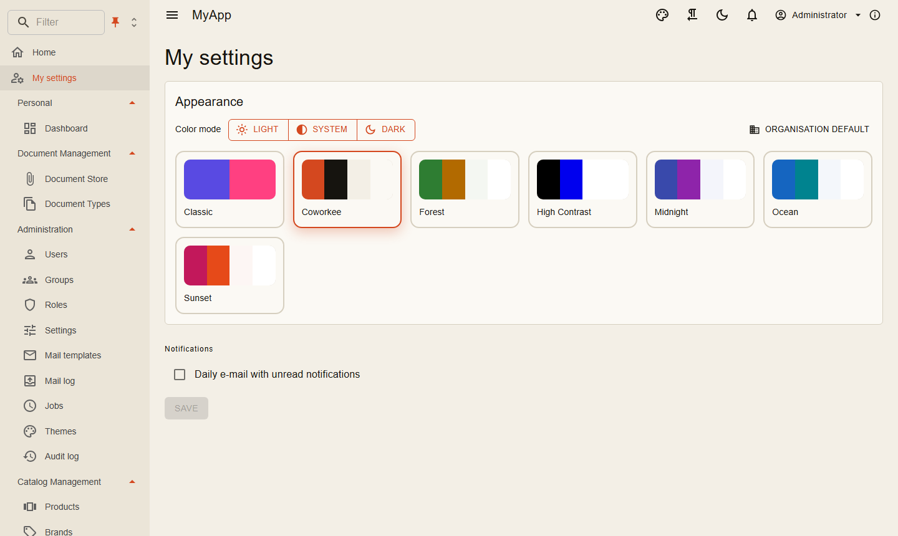

# Themes

Themes sind Daten: Palette für hellen und dunklen Modus, Typografie, Eckenradius, Logo, eigenes CSS. Sieben Themes sind eingebaut (Coworkee, Classic, Ocean, Forest, Midnight, Sunset und High Contrast); Administratoren legen im Theme-Editor mit Live-Vorschau eigene pro Mandant an.

{ .shot }

- Der Standard des Mandanten gilt für alle; Benutzer wählen auf *My settings* oder über die Palette in der App-Leiste ein anderes Theme und hellen, dunklen oder System-Modus.
- Das Setup bietet das Theme als eigenen Schritt an.
- `ThemeService` im Client wendet ein Theme zur Laufzeit an (`Apply`, `Preview`, `SetMode`).
