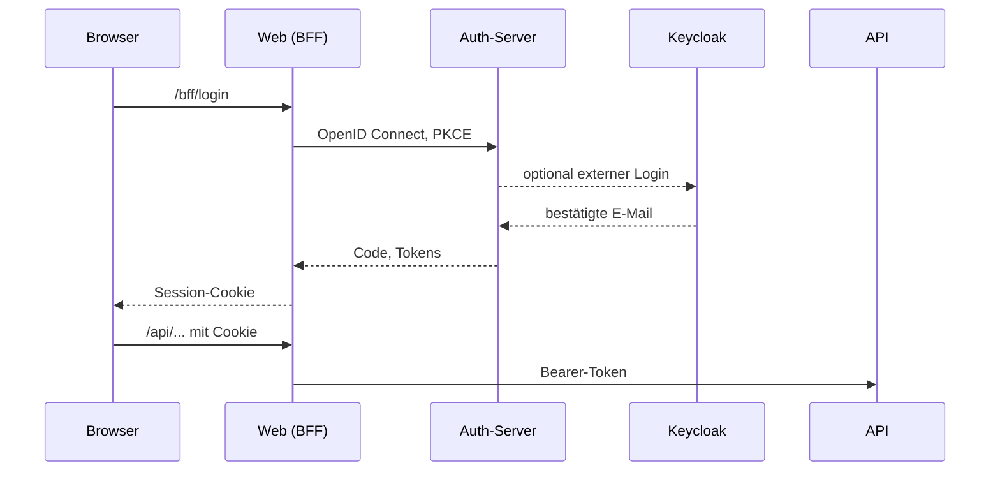
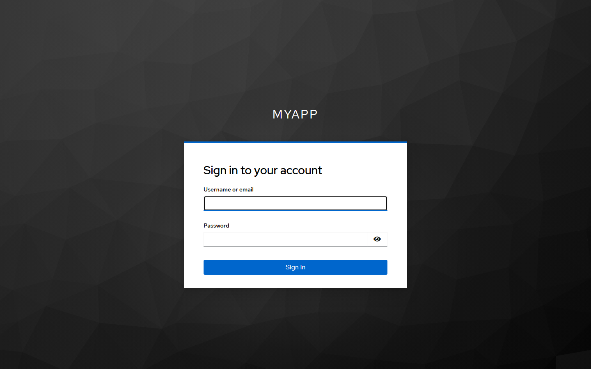

# Anmeldung und Keycloak

Drei Hosts teilen sich die Arbeit:



| Host | Paket | Aufgabe |
|---|---|---|
| Auth | `Coworkee.AuthServer` | OpenIddict-Server, Anmeldung, Registrierung, Passwort zurücksetzen, Zwei-Faktor, Kontoseite, externe Anbieter |
| Web | `Coworkee.Bff` | hält die Tokens auf dem Server, gibt dem Browser ein Cookie, leitet `/api`, `/odata`, `/hubs` und `/admin/jobs` weiter |
| API | `Coworkee.AspNetCore` | prüft Bearer-Tokens (`AddCoworkeeApiAuthentication`) |

Der Browser sieht nie ein Access-Token. Die Anmeldung samt Tokens liegt in einem Sitzungsspeicher auf dem Server (Redis, wenn ein Connection String `redis` gesetzt ist, sonst im Speicher), das Cookie enthält nur einen Sitzungsschlüssel. Anfragen des Clients tragen den Header `X-CSRF: 1`, den `ApiClientBase` setzt.

## Clients und Scopes

Der Auth-Server legt seine OpenID-Connect-Clients beim Start aus der Konfiguration an. Mit dem [AppHost](../hosting/aspire.md) setzen Sie nichts davon; von Hand sieht es so aus:

```json
"Coworkee": {
  "Auth": {
    "ApiScopes": { "myapp_api": "myapp_api" },
    "Clients": [{
      "ClientId": "myapp-web",
      "DisplayName": "MyApp",
      "Scopes": [ "myapp_api" ],
      "RedirectUris": [ "https://localhost:7300/signin-oidc" ],
      "PostLogoutRedirectUris": [ "https://localhost:7300/signout-callback-oidc" ]
    }]
  }
}
```

Außerhalb der Entwicklung konfigurieren Sie `SigningCertificate` und `EncryptionCertificate` (Pfad und Passwort einer PKCS#12-Datei).

## Externer Login mit Keycloak

Jeder OpenID-Connect-Anbieter kann Benutzer anmelden. Jeder ist ein Abschnitt unter `Coworkee:Auth:External:Providers`:

```json
"Coworkee": {
  "Auth": {
    "External": {
      "Mode": "Both",
      "AutoProvision": true,
      "Providers": {
        "keycloak": {
          "DisplayName": "Keycloak",
          "Authority": "https://keycloak.example.com/realms/myapp",
          "ClientId": "myapp-auth",
          "ClientSecret": "..."
        }
      }
    }
  }
}
```

| Einstellung | Bedeutung |
|---|---|
| `Mode` | `Internal` nur Passwort, `External` nur Anbieter, `Both` (Standard) |
| `AutoProvision` | legt beim ersten externen Login ein Konto an, wenn keines die E-Mail hat |
| `Scopes` | Standard `openid profile email` |
| `RequireHttpsMetadata` | `false` nur für ein lokales Keycloak über http |

Bei der Anmeldung sucht der Auth-Server den Benutzer in dieser Reihenfolge: über den verknüpften externen Login, dann über ein Konto mit derselben E-Mail, dann legt er ein neues an. Die Verknüpfung über die E-Mail setzt voraus, dass der Anbieter die Adresse als bestätigt meldet (`email_verified`) oder mit `TrustEmail` konfiguriert ist, sonst wird die Anmeldung abgelehnt. Neue Benutzer folgen den [Registrierungseinstellungen](registration.md) und starten ohne Rollen.

Lokal startet `options.UseKeycloak()` im AppHost ein Keycloak mit einem Realm für die App und konfiguriert all das.

{ .shot }

## Setup-Assistent oder Seed

Eine neue Installation braucht einen Mandanten und einen ersten Administrator. Zwei Wege:

**Assistent.** Die API antwortet mit `503 setup_required`, bis das Setup erledigt ist. Der Blazor-Client zeigt die Setup-Seite: Prüfungen, Organisation, Administrator, Theme. Das Setup-Token steht im Log der API oder wird mit `Coworkee:SetupToken` gesetzt. So arbeitet Sharemee.

**Seed.** `AddCoworkeeIdentitySeed` im Migrations-Dienst legt beim ersten Start alles an; der Assistent erscheint nie. So arbeitet das Template.

```csharp
public static void Configure(IdentitySeedOptions seed)
{
    seed.TenantName = "MyApp";
    seed.Roles.Add(new SeedRole("Brand Manager", "Maintains brands", [CatalogPermissions.Brands.View, CatalogPermissions.Brands.Edit]));
    seed.Users.Add(new SeedUser("admin@example.com", password, "Ada", "Admin", IsAdmin: true));
    seed.Users.Add(new SeedUser("brands@example.com", password) { Roles = ["Brand Manager"] });
}
```

## Kontofunktionen

Registrierung ist standardmäßig aus; die Einstellung `Account.AllowRegistration` schaltet sie ein. Assistent, Freischaltung, erlaubte Adressen, Dokumente und Anmelderegeln beschreibt [Registrierung und Anmelderegeln](registration.md). Passwort und Zwei-Faktor ändern Benutzer auf der Kontoseite des Auth-Servers, verlinkt aus dem Benutzermenü. Die E-Mail-Adresse ändern sie in der App unter *Konto > Sicherheit*: nach dem aktuellen Passwort bekommt die neue Adresse einen Bestätigungslink und die alte einen Hinweis; die alte Adresse gilt, bis der Link geöffnet wird. Eine Adresse, die ein anderes Konto nutzt, bekommt keinen Link, und die Antwort bleibt gleich, so erfährt niemand, welche Adressen es gibt.

Auf der Seite eines Benutzers bearbeiten Administratoren alles: Benutzername, Namen, Telefon, Adresse, Sprache, aktiv, E-Mail bestätigt, die Adresse selbst (sofort, bestätigt oder mit Bestätigungsmail; die alte Adresse bekommt einen Hinweis), das Passwort (setzen oder Link zum Zurücksetzen senden), eine Einladung für Benutzer ohne Passwort, Sperre, Zurücksetzen der Zwei-Faktor-Anmeldung, externe Anmeldungen, Rollen, Gruppen und das Bild. Neue Benutzer entstehen in einem Dialog, entweder per Mail eingeladen, ein Passwort zu wählen, oder mit einem Startpasswort.

Administratoren verwalten weitere Clients und Scopes in der App, beenden Sitzungen sofort und legen Passwortregeln fest: siehe [Clients, Sitzungen und Passwortregeln](clients.md).
