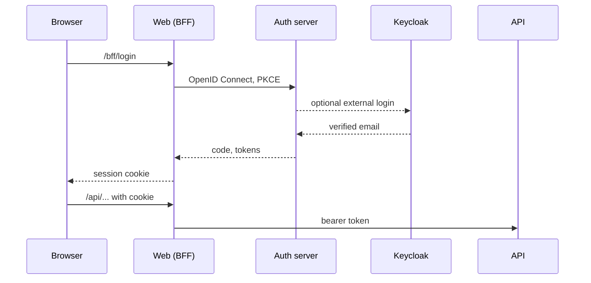

# Authentication and Keycloak

Three hosts share the work:



| Host | Package | Job |
|---|---|---|
| Auth | `Coworkee.AuthServer` | OpenIddict server, sign-in, registration, password reset, two factor, account page, external providers |
| Web | `Coworkee.Bff` | keeps tokens on the server, gives the browser a cookie, forwards `/api`, `/odata`, `/hubs` and `/admin/jobs` |
| API | `Coworkee.AspNetCore` | validates bearer tokens (`AddCoworkeeApiAuthentication`) |

The browser never sees an access token. The sign-in with its tokens lives in a server-side session store (Redis when a `redis` connection string is set, otherwise memory), so the cookie only holds a session key. Requests from the client carry the `X-CSRF: 1` header, which `ApiClientBase` adds.

## Clients and scopes

The auth server creates its OpenID Connect clients from configuration on start. With the [app host](../hosting/aspire.md) you set nothing; by hand it looks like this:

```json
"Coworkee": {
  "Auth": {
    "ApiScopes": { "myapp_api": "myapp_api" },
    "Clients": [{
      "ClientId": "myapp-web",
      "DisplayName": "MyApp",
      "Scopes": [ "myapp_api" ],
      "RedirectUris": [ "https://localhost:7300/signin-oidc" ],
      "PostLogoutRedirectUris": [ "https://localhost:7300/signout-callback-oidc" ]
    }]
  }
}
```

Outside development, configure `SigningCertificate` and `EncryptionCertificate` (PKCS#12 path and password).

## External login with Keycloak

Any OpenID Connect provider can sign users in. Each one is a section under `Coworkee:Auth:External:Providers`:

```json
"Coworkee": {
  "Auth": {
    "External": {
      "Mode": "Both",
      "AutoProvision": true,
      "Providers": {
        "keycloak": {
          "DisplayName": "Keycloak",
          "Authority": "https://keycloak.example.com/realms/myapp",
          "ClientId": "myapp-auth",
          "ClientSecret": "..."
        }
      }
    }
  }
}
```

| Setting | Meaning |
|---|---|
| `Mode` | `Internal` password only, `External` providers only, `Both` (default) |
| `AutoProvision` | create a user on the first external sign-in when no account has the email |
| `Scopes` | defaults to `openid profile email` |
| `RequireHttpsMetadata` | `false` only for a local Keycloak on http |

On sign-in the auth server looks for the user in this order: the linked external login, then an account with the same email, then a new account. Linking by email requires the provider to mark the address as verified (`email_verified`) or to be configured with `TrustEmail`, otherwise the sign-in is refused. New users follow the [registration settings](registration.md) and start without roles.

Locally, `options.UseKeycloak()` in the app host starts Keycloak with a realm for the app and configures all of this.

{ .shot }

## Setup wizard or seed

A new installation needs a tenant and a first administrator. Two ways:

**Wizard.** The API answers `503 setup_required` until setup is done. The Blazor client shows the setup page: checks, organization, administrator, theme. The setup token is printed in the API log, or set with `Coworkee:SetupToken`. Sharemee works this way.

**Seed.** `AddCoworkeeIdentitySeed` in the migration service creates everything on the first start; the wizard never appears. The template works this way.

```csharp
public static void Configure(IdentitySeedOptions seed)
{
    seed.TenantName = "MyApp";
    seed.Roles.Add(new SeedRole("Brand Manager", "Maintains brands", [CatalogPermissions.Brands.View, CatalogPermissions.Brands.Edit]));
    seed.Users.Add(new SeedUser("admin@example.com", password, "Ada", "Admin", IsAdmin: true));
    seed.Users.Add(new SeedUser("brands@example.com", password) { Roles = ["Brand Manager"] });
}
```

## Account features

Registration is off by default; the setting `Account.AllowRegistration` turns it on. The wizard, activation, allowed addresses, documents and the sign-in rules are described in [Registration and sign-in rules](registration.md). Users change password and two factor settings on the account page of the auth server, linked from the user menu. The email address changes under *Account > Security* in the app: after the current password, the new address gets a confirmation link and the old one a notice; the old address keeps working until the link is opened. An address another account uses gets no link, and the answer is the same, so nobody learns which addresses exist.

On a user's page administrators edit everything about the user: user name, names, phone, address, language, active, email confirmed, the address itself (at once, confirmed or with a confirmation mail; the old address gets a notice), the password (set one or send a reset link), an invitation for users without password, lockout, two-step verification reset, external sign-ins, roles, groups and the picture. New users are created in a dialog, either invited by mail to choose a password or with an initial password.

Administrators manage further clients and scopes in the app, end sessions at once and set password rules: see [Clients, sessions and password rules](clients.md).
