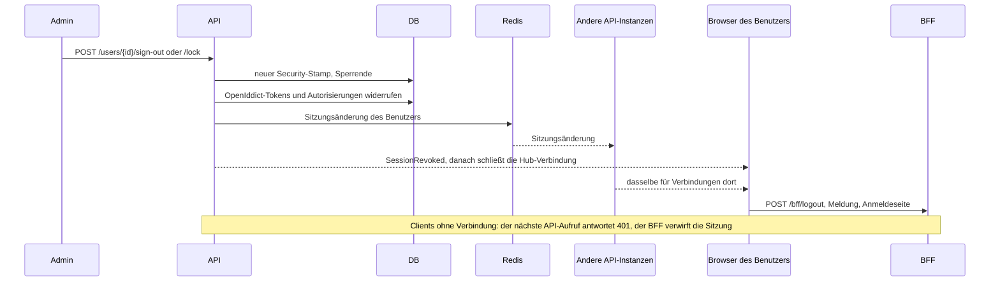

# Clients, Sitzungen und Passwortregeln

Der Auth-Server ist ein vollständiger OpenID-Connect-Provider. Neben den Clients aus der Konfiguration verwalten Administratoren der Systemorganisation weitere Clients und Scopes in der App, beenden Sitzungen sofort und legen die Passwortregeln fest.

## Clients und Scopes in der App

**Administration › Anwendungen** listet alle OpenID-Connect-Clients, **Administration › Scopes** die Scopes, die sie anfragen dürfen. Beide brauchen die Berechtigung `Identity.Clients.Manage` und funktionieren nur in der Systemorganisation, wie die Mandantenseite.

| Feld | Bedeutung |
|---|---|
| Client-ID | die `client_id`, die der Client sendet |
| Typ | `public` (Browser- und Mobile-Apps, nur PKCE) oder `confidential` (Server mit Geheimnis) |
| Zustimmung | `implicit` meldet direkt an, `explicit` fragt den Benutzer einmal je Scope-Auswahl |
| Weiterleitungsadressen | wohin Codes gehen dürfen; ihre Origins kommen auch in die `form-action` der Content Security Policy |
| Adressen nach der Abmeldung | erlaubte Werte für `post_logout_redirect_uri` |
| Refresh-Tokens erlauben | ergänzt den Grant `refresh_token` neben `authorization_code` |
| Scopes | `openid profile email roles offline_access` und API-Scopes |
| Dienst-Client | ergänzt den Grant `client_credentials` (siehe unten); ohne Weiterleitungsadressen meldet der Client niemanden an |

Ein vertraulicher Client bekommt ein erzeugtes Geheimnis. Es erscheint genau einmal, direkt nach dem Anlegen oder nach **Neues Geheimnis**; die Datenbank behält nur seinen Hash.

Clients und API-Scopes aus `Coworkee:Auth` werden bei jedem Start in die OpenIddict-Tabellen geschrieben und als aus der Konfiguration stammend markiert. Die Seiten zeigen sie mit einem Schloss und ändern sie nicht; geändert werden sie in der Konfiguration. Markierte Clients und Scopes, die die Konfiguration nicht mehr nennt, werden beim Start entfernt; in den Seiten angelegte bleiben. Die Ressourcen eines Scopes werden zu Audiences des Access-Tokens: Ein Scope `reports` mit der Ressource `reports_api` liefert Tokens, die eine API mit der Audience `reports_api` annimmt.

```http
GET    /api/v1/identity/clients
POST   /api/v1/identity/clients          → { id, clientSecret }
PUT    /api/v1/identity/clients/{id}     → { id, clientSecret }, wenn er vertraulich wurde
POST   /api/v1/identity/clients/{id}/secret
DELETE /api/v1/identity/clients/{id}
GET|POST /api/v1/identity/scopes, PUT|DELETE /api/v1/identity/scopes/{id}
```

Die Endpunkte liegen in `CoworkeeAuthStoreModule`, das der API-Host zusammen mit den OpenIddict-Stores lädt.

## Dienst-Clients

Ein vertraulicher Client mit **Dienst-Client** ruft APIs selbst auf, ohne Benutzer, über den Grant `client_credentials`. Er handelt in der Systemorganisation mit den Berechtigungen der Rollen und der Berechtigungsliste, die in seiner Zeile unter **Administration › Anwendungen** gewählt sind:

```http
POST /connect/token
grant_type=client_credentials&client_id=reporting&client_secret=…&scope=myapp_api
```

- Das Access-Token nennt den Client als `sub` und `client_id` und trägt `tenant`, die Rollennamen und die gelisteten Berechtigungen (`permission`).
- In der API ist `ICurrentUser.UserId` `null` und `ICurrentUser.ClientId` die Client-ID; `IPermissionChecker` gewährt, was die Rollen gewähren (Änderungen gelten sofort), plus die gelisteten Berechtigungen (sie gelten ab dem nächsten Token).
- Systemrollen können Clients nicht erhalten, und Administratoren vergeben nur Berechtigungen, die sie selbst haben.
- Dienst-Clients haben keine Sitzung: Es gibt kein Refresh-Token, ein neues Token kommt wieder vom Token-Endpunkt.

## Zustimmung und berechtigte Anwendungen

Bei einem Client mit expliziter Zustimmung zeigt der Auth-Server **Zugriff erlauben** mit den angefragten Scopes. Erlauben speichert eine dauerhafte Autorisierung; Ablehnen gibt `consent_required` an den Client zurück.

Auf der Kontoseite (**Kontosicherheit › Berechtigte Anwendungen**) sehen Benutzer jede Anwendung mit Zugriff, seit wann und mit welchen Scopes, und widerrufen sie. Widerrufen beendet die Autorisierungen und Tokens dieser Anwendung; sie muss erneut um eine Anmeldung bitten.

## Überall abmelden und sperren

Die Benutzerdetailseite hat **Überall abmelden** und **Sperren** (bis zu einem Tag oder bis zum Entsperren); **Entsperren** hebt eine Sperre auf. Alles wirkt sofort:



- Access-Tokens tragen `stamp`, einen Hash des Security-Stamps. Die API vergleicht ihn bei jeder Anfrage und antwortet `401`, sobald sich der Stamp geändert hat.
- Die Stamps liegen eine Minute im HybridCache, mit Redis als zweiter Ebene, wenn der Connection-String `redis` gesetzt ist. Jede gespeicherte Stamp-Änderung (egal von wem: Administrator, Passwortänderung, Einrichtung der Zwei-Faktor-Anmeldung) geht als Sitzungsänderung hinaus: Über Redis Pub/Sub verwirft jede API-Instanz ihren gecachten Stamp sofort; ohne Redis hört es nur die eigene Instanz, die anderen merken es innerhalb der Minute.
- Jede Instanz kennt ihre Realtime-Verbindungen je Benutzer. Bei einer Sitzungsänderung schickt sie `SessionRevoked` (Grund `signed-out`, `locked` oder `password-changed`) an die Verbindungen, deren Token nicht mehr gilt, und schließt sie eine Sekunde später; `SessionGuard` im Layout meldet ab und sagt dem Benutzer warum.
- Der BFF beendet seine Cookie-Sitzung, wenn die API auf eine Anfrage mit Token `401` antwortet.
- Refresh-Tokens werden widerrufen und, mit dem alten Stamp ausgestellt, ohnehin abgelehnt; das Anmelde-Cookie des Auth-Servers zählt bei `/connect/authorize` nicht mehr.

Administratoren können ihre eigene Sitzung so nicht beenden, und nur Administratoren können andere Administratoren abmelden oder sperren.

### Das eigene Passwort ändern

Ein neues Passwort ändert den Stamp ebenfalls, eine Passwortänderung beendet also die anderen Sitzungen: Ihre Tokens und Refresh-Tokens werden abgelehnt, ihre Realtime-Verbindungen schließen, ihre Anmeldung am Auth-Server zählt nicht mehr. Die Sitzung, in der das Passwort geändert wurde, läuft weiter: Jede Anmeldung am Auth-Server bekommt eine Sitzungs-ID, die in ihre Tokens geht (`sid`), und der Benutzerdatensatz merkt sich diese ID mit dem Stamp davor (`KeptSession`). Ihre Tokens bleiben bis zur nächsten Erneuerung gültig, die sie für den neuen Stamp ausstellt; jede spätere Stamp-Änderung hebt die Ausnahme auf.

Andere Module klinken sich mit `IUserSessionListener` ein (aufgerufen, nachdem ein Administrator die Sitzungen eines Benutzers beendet hat).

## Passwortregeln und Sperre

Die Meldungen von ASP.NET Core Identity (Passwortregeln, vergebene E-Mail-Adresse oder vergebener Benutzername, ungültige Codes und Links) folgen der Sprache der Anfrage: `LocalizedIdentityErrorDescriber` übersetzt sie über `ITextTranslator`, den der Auth-Server aus seinen `Texts/{Sprache}.json` und `Coworkee.Localization` aus den Modultexten (`Localization/{Sprache}.json`) speist, sodass auch die Admin-Seiten der API sie übersetzt zeigen.

**Administration › Einstellungen › Anmeldesicherheit**, alles zur Laufzeit:

| Einstellung | Standard | Bedeutung |
|---|---|---|
| `Account.Lockout.MaxFailedAttempts` | 10 | falsche Passwörter oder Codes in Folge bis zur Sperre |
| `Account.Lockout.Minutes` | 15 | wie lange diese Sperre dauert |
| `Account.Password.ExpiryDays` | 0 | nach so vielen Tagen verlangt die Anmeldung ein neues Passwort; 0 nie |
| `Account.Password.History` | 0 | ein neues Passwort darf keines der letzten so vielen sein (bis zu 24 werden behalten) |

Administratoren setzen beim Anlegen eines Benutzers **Passwort bei der ersten Anmeldung ändern** oder auf der Benutzerdetailseite **Passwort bei der nächsten Anmeldung ändern**. Nach der Anmeldung und bevor der Client Tokens bekommt, zeigt der Auth-Server **Neues Passwort wählen**; dasselbe passiert, wenn das Passwort abgelaufen ist. Wer sich nur über einen externen Anbieter anmeldet, hat kein Passwort und wird nie gefragt.

## Branding der Kontoseiten

Die Kontoseiten nehmen den App-Namen aus `Coworkee:Auth:DisplayName` und Logo und Farben aus dem Standard-Theme der Systemorganisation ([Themes](../modules/theming.md)); Änderungen erscheinen innerhalb einer Minute. Ein Theme ohne Logo zeigt `Coworkee:Auth:LogoUrl`, eine absolute Adresse oder einen Pfad auf dem Auth-Server; die Content Security Policy erlaubt den Origin einer absoluten Adresse als Bildquelle. Im AppHost verweist `options.LogoUrl = "/coworkee-icon.svg"` den Auth-Server auf diesen Pfad der Web-App.
