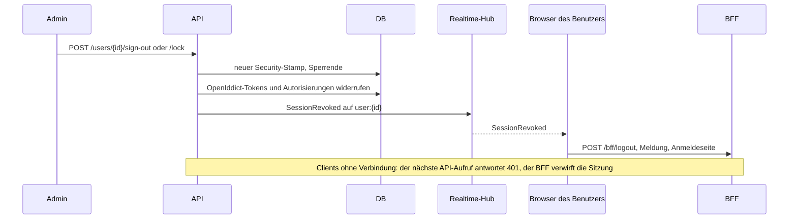

# Clients, Sitzungen und Passwortregeln

Der Auth-Server ist ein vollständiger OpenID-Connect-Provider. Neben den Clients aus der Konfiguration verwalten Administratoren der Systemorganisation weitere Clients und Scopes in der App, beenden Sitzungen sofort und legen die Passwortregeln fest.

## Clients und Scopes in der App

**Administration › Anwendungen** listet alle OpenID-Connect-Clients, **Administration › Scopes** die Scopes, die sie anfragen dürfen. Beide brauchen die Berechtigung `Identity.Clients.Manage` und funktionieren nur in der Systemorganisation, wie die Mandantenseite.

| Feld | Bedeutung |
|---|---|
| Client-ID | die `client_id`, die der Client sendet |
| Typ | `public` (Browser- und Mobile-Apps, nur PKCE) oder `confidential` (Server mit Geheimnis) |
| Zustimmung | `implicit` meldet direkt an, `explicit` fragt den Benutzer einmal je Scope-Auswahl |
| Weiterleitungsadressen | wohin Codes gehen dürfen; ihre Origins kommen auch in die `form-action` der Content Security Policy |
| Adressen nach der Abmeldung | erlaubte Werte für `post_logout_redirect_uri` |
| Refresh-Tokens erlauben | ergänzt den Grant `refresh_token` neben `authorization_code` |
| Scopes | `openid profile email roles offline_access` und API-Scopes |

Ein vertraulicher Client bekommt ein erzeugtes Geheimnis. Es erscheint genau einmal, direkt nach dem Anlegen oder nach **Neues Geheimnis**; die Datenbank behält nur seinen Hash.

Clients und API-Scopes aus `Coworkee:Auth` werden bei jedem Start in die OpenIddict-Tabellen geschrieben und als aus der Konfiguration stammend markiert. Die Seiten zeigen sie mit einem Schloss und ändern sie nicht; geändert werden sie in der Konfiguration. Die Ressourcen eines Scopes werden zu Audiences des Access-Tokens: Ein Scope `reports` mit der Ressource `reports_api` liefert Tokens, die eine API mit der Audience `reports_api` annimmt.

```http
GET    /api/v1/identity/clients
POST   /api/v1/identity/clients          → { id, clientSecret }
PUT    /api/v1/identity/clients/{id}     → { id, clientSecret }, wenn er vertraulich wurde
POST   /api/v1/identity/clients/{id}/secret
DELETE /api/v1/identity/clients/{id}
GET|POST /api/v1/identity/scopes, PUT|DELETE /api/v1/identity/scopes/{id}
```

Die Endpunkte liegen in `CoworkeeAuthStoreModule`, das der API-Host zusammen mit den OpenIddict-Stores lädt.

## Zustimmung und berechtigte Anwendungen

Bei einem Client mit expliziter Zustimmung zeigt der Auth-Server **Zugriff erlauben** mit den angefragten Scopes. Erlauben speichert eine dauerhafte Autorisierung; Ablehnen gibt `consent_required` an den Client zurück.

Auf der Kontoseite (**Kontosicherheit › Berechtigte Anwendungen**) sehen Benutzer jede Anwendung mit Zugriff, seit wann und mit welchen Scopes, und widerrufen sie. Widerrufen beendet die Autorisierungen und Tokens dieser Anwendung; sie muss erneut um eine Anmeldung bitten.

## Überall abmelden und sperren

Die Benutzerdetailseite hat **Überall abmelden** und **Sperren** (bis zu einem Tag oder bis zum Entsperren); **Entsperren** hebt eine Sperre auf. Alles wirkt sofort:



- Access-Tokens tragen `stamp`, einen Hash des Security-Stamps. Die API vergleicht ihn bei jeder Anfrage (gecacht, bei jeder Änderung des Benutzers verworfen) und antwortet `401`, sobald sich der Stamp geändert hat.
- Der BFF beendet seine Cookie-Sitzung, wenn die API auf eine Anfrage mit Token `401` antwortet.
- Refresh-Tokens werden widerrufen und, mit dem alten Stamp ausgestellt, ohnehin abgelehnt; das Anmelde-Cookie des Auth-Servers zählt bei `/connect/authorize` nicht mehr.
- `SessionRevoked` erreicht die offenen Clients auf dem Topic des Benutzers; `SessionGuard` im Layout meldet ab und sagt dem Benutzer warum.

Ein neues Passwort ändert den Stamp ebenfalls, eine Passwortänderung beendet also die anderen Sitzungen. Administratoren können ihre eigene Sitzung so nicht beenden, und nur Administratoren können andere Administratoren abmelden oder sperren.

Andere Module klinken sich mit `IUserSessionListener` ein (aufgerufen, nachdem ein Administrator die Sitzungen eines Benutzers beendet hat).

## Passwortregeln und Sperre

**Administration › Einstellungen › Anmeldesicherheit**, alles zur Laufzeit:

| Einstellung | Standard | Bedeutung |
|---|---|---|
| `Account.Lockout.MaxFailedAttempts` | 10 | falsche Passwörter oder Codes in Folge bis zur Sperre |
| `Account.Lockout.Minutes` | 15 | wie lange diese Sperre dauert |
| `Account.Password.ExpiryDays` | 0 | nach so vielen Tagen verlangt die Anmeldung ein neues Passwort; 0 nie |
| `Account.Password.History` | 0 | ein neues Passwort darf keines der letzten so vielen sein (bis zu 24 werden behalten) |

Administratoren setzen beim Anlegen eines Benutzers **Passwort bei der ersten Anmeldung ändern** oder auf der Benutzerdetailseite **Passwort bei der nächsten Anmeldung ändern**. Nach der Anmeldung und bevor der Client Tokens bekommt, zeigt der Auth-Server **Neues Passwort wählen**; dasselbe passiert, wenn das Passwort abgelaufen ist. Wer sich nur über einen externen Anbieter anmeldet, hat kein Passwort und wird nie gefragt.

## Branding der Kontoseiten

Die Kontoseiten nehmen den App-Namen aus `Coworkee:Auth:DisplayName` und Logo und Farben aus dem Standard-Theme der Systemorganisation ([Themes](../modules/theming.md)); Änderungen erscheinen innerhalb einer Minute.
