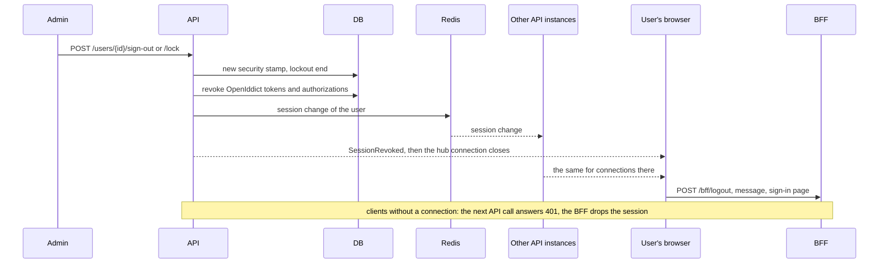

# Clients, sessions and password rules

The auth server is a full OpenID Connect provider. Besides the clients from the configuration, administrators of the system organisation manage further clients and scopes in the app, end sessions at once and set the password rules.

## Clients and scopes in the app

**Administration › Applications** lists every OpenID Connect client, **Administration › Scopes** the scopes they may ask for. Both need the permission `Identity.Clients.Manage` and work only in the system organisation, like the tenants page.

| Field | Meaning |
|---|---|
| Client id | the `client_id` the client sends |
| Type | `public` (browser and mobile apps, PKCE only) or `confidential` (servers with a secret) |
| Consent | `implicit` signs in straight away, `explicit` asks the user once per scope set |
| Redirect addresses | where codes may go; their origins also enter the `form-action` of the content security policy |
| Addresses after sign-out | allowed `post_logout_redirect_uri` values |
| Allow refresh tokens | adds the `refresh_token` grant next to `authorization_code` |
| Scopes | `openid profile email roles offline_access` plus API scopes |
| Service client | adds the `client_credentials` grant (see below); without redirect addresses the client signs nobody in |

A confidential client gets a generated secret. It is shown once, right after creating it or after **New secret**; the database keeps only its hash.

Clients and API scopes from `Coworkee:Auth` are written to the OpenIddict tables on every start and marked as coming from the configuration. The pages show them with a lock and do not change them; change them in the configuration. Marked clients and scopes the configuration no longer names are removed at the start; those created in the pages stay. A scope's resources become the audiences of the access token, so a scope `reports` with the resource `reports_api` gives tokens an API with the audience `reports_api` accepts.

```http
GET    /api/v1/identity/clients
POST   /api/v1/identity/clients          → { id, clientSecret }
PUT    /api/v1/identity/clients/{id}     → { id, clientSecret } when it turned confidential
POST   /api/v1/identity/clients/{id}/secret
DELETE /api/v1/identity/clients/{id}
GET|POST /api/v1/identity/scopes, PUT|DELETE /api/v1/identity/scopes/{id}
```

The endpoints live in `CoworkeeAuthStoreModule`, which the API host loads together with the OpenIddict stores.

## Service clients

A confidential client with **Service client** calls APIs on its own, without a user, through the `client_credentials` grant. It acts in the system organisation with the permissions of the roles and of the permission list picked in its row of **Administration › Applications**:

```http
POST /connect/token
grant_type=client_credentials&client_id=reporting&client_secret=…&scope=myapp_api
```

- The access token names the client as `sub` and `client_id`, carries `tenant`, the role names and the listed permissions (`permission`).
- In the API, `ICurrentUser.UserId` is `null` and `ICurrentUser.ClientId` the client id; `IPermissionChecker` grants what the roles grant (changes count at once) plus the listed permissions (they count from the next token).
- System roles cannot be given to clients, and administrators can give only permissions they have themselves.
- Service clients have no session: there is no refresh token, a new token comes from the token endpoint again.

## Consent and authorized applications

For a client with explicit consent the auth server shows **Allow access** with the requested scopes. Allowing stores a permanent authorization; declining returns `consent_required` to the client.

On the account page (**Account security › Authorized applications**) users see every application with access, since when and with which scopes, and revoke it. Revoking ends the authorizations and tokens of that application; it has to ask for a sign-in again.

## Signing out everywhere and locking

The user detail page has **Sign out everywhere** and **Lock** (until a day or until unlocked); **Unlock** lifts a lock. All take effect at once:



- Access tokens carry `stamp`, a hash of the security stamp. The API compares it on every request and answers `401` once the stamp changed.
- The stamps are cached for a minute in HybridCache, with Redis as second level when the connection string `redis` is set. Every saved stamp change (whoever made it: administrator, password change, two-step setup) goes out as session change: through Redis pub/sub every API instance drops its cached stamp at once; without Redis only the own instance hears it and the others notice within the minute.
- Each instance keeps its realtime connections per user. On a session change it sends `SessionRevoked` (reason `signed-out`, `locked` or `password-changed`) to the connections whose token no longer counts and closes them a second later; `SessionGuard` in the layout signs out and tells the user why.
- The BFF ends its cookie session when the API answers `401` to a request it sent a token with.
- Refresh tokens are revoked and, issued with the old stamp, refused anyway; the auth server's own sign-in cookie no longer counts at `/connect/authorize`.

Administrators cannot end their own session this way, and only administrators can sign out or lock other administrators.

### Changing the own password

A new password changes the stamp too, so changing it ends the other sessions: their tokens and refresh tokens are refused, their realtime connections close, their sign-in at the auth server no longer counts. The session that changed it keeps going: every sign-in at the auth server gets a session id that goes into its tokens (`sid`), and the user's record keeps that id with the stamp before (`KeptSession`). Its tokens stay valid until their next refresh, which issues them for the new stamp; any later stamp change voids the exception.

Other modules hook in with `IUserSessionListener` (called after an administrator ended a user's sessions).

## Password rules and lockout

The messages of ASP.NET Core Identity (password rules, taken e-mail address or user name, invalid codes and links) follow the request language: `LocalizedIdentityErrorDescriber` translates them through `ITextTranslator`, which the auth server feeds from its `Texts/{language}.json` and `Coworkee.Localization` from the module texts (`Localization/{language}.json`), so the admin pages of the API show them translated too.

**Administration › Settings › Sign-in security**, all at runtime:

| Setting | Default | Meaning |
|---|---|---|
| `Account.Lockout.MaxFailedAttempts` | 10 | wrong passwords or codes in a row before the lockout |
| `Account.Lockout.Minutes` | 15 | how long that lockout lasts |
| `Account.Password.ExpiryDays` | 0 | after so many days the sign-in asks for a new password; 0 never |
| `Account.Password.History` | 0 | a new password may not be one of the last so many (up to 24 are kept) |

Administrators tick **Change password at first sign-in** when they create a user, or **Change password at next sign-in** on the user detail page. After the sign-in, before the client gets tokens, the auth server shows **Choose a new password**; the same happens when the password expired. Users who sign in only with an external provider have no password and are never asked.

## Branding of the account pages

The account pages take the app name from `Coworkee:Auth:DisplayName` and logo and colors from the default theme of the system organisation ([Theming](../modules/theming.md)); changes show within a minute. A theme without logo shows `Coworkee:Auth:LogoUrl`, an absolute address or a path on the auth server; the content security policy allows the origin of an absolute address as image source. In the app host, `options.LogoUrl = "/coworkee-icon.svg"` points the auth server at that path of the web app.
