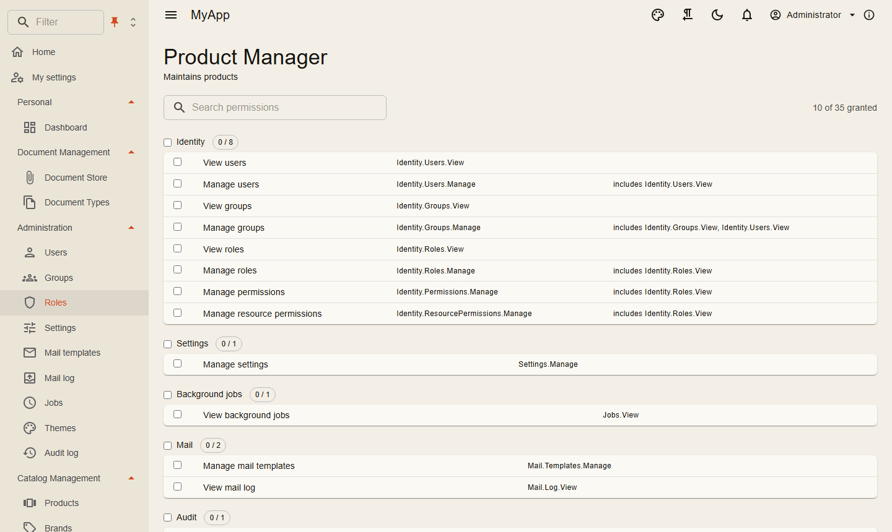

# Permissions

Permissions are strings, defined by the modules, granted to roles, groups or single users, and checked on the server and in the UI.

## Defining

```csharp
internal sealed class CatalogPermissionDefinitions : IPermissionDefinitionContributor
{
    public void Define(PermissionDefinitionContext context) =>
        context.Group(CatalogPermissions.GroupName, "Catalog")
            .Add(CatalogPermissions.Products.View, "View products")
            .Add(CatalogPermissions.Products.Edit, "Edit products", CatalogPermissions.Products.View);
}

services.AddSingleton<IPermissionDefinitionContributor, CatalogPermissionDefinitions>();
```

The definitions build the permission matrix in the role editor: grouped, searchable, with counts and a toggle per group.

{ .shot }

## Checking on the server

| Where | How |
|---|---|
| A request | `[RequiresPermission(CatalogPermissions.Products.Delete)]` on the request type |
| Inside a handler | `await permissions.IsGrantedAsync(CatalogPermissions.Products.Edit, ct)` with `IPermissionChecker` |
| A single resource | `await permissions.IsGrantedAsync(permission, "Folder", folderId, ct)` |
| An endpoint group | `.RequireAuthorization()` plus the request attribute |
| An OData set | the permission passed to `AddODataEntity` |

Resource grants inherit along a hierarchy you describe with `IResourceHierarchy` (folders in folders, for example). `IResourceRestriction` takes access away again for certain roles, even from holders of a global grant.

## Checking in the UI

```razor
@attribute [Authorize(Policy = PermissionPolicy.Prefix + CatalogPermissions.Products.View)]

<PermissionGate Permission="@CatalogPermissions.Products.Create">
    <MudButton OnClick="CreateAsync">New product</MudButton>
</PermissionGate>
```

`PermissionGate` renders its content only with the permission; navigation entries and table buttons take a permission parameter and hide themselves. The client loads the effective permissions of the user after sign-in.

The UI only hides. The server decides.

## Seeding roles

```csharp
seed.Roles.Add(new SeedRole("Product Manager", "Maintains products",
    [CatalogPermissions.Products.View, CatalogPermissions.Products.Create, CatalogPermissions.Products.Edit]));
```

See [Persistence](../fundamentals/persistence.md#migrations-and-seeding).
