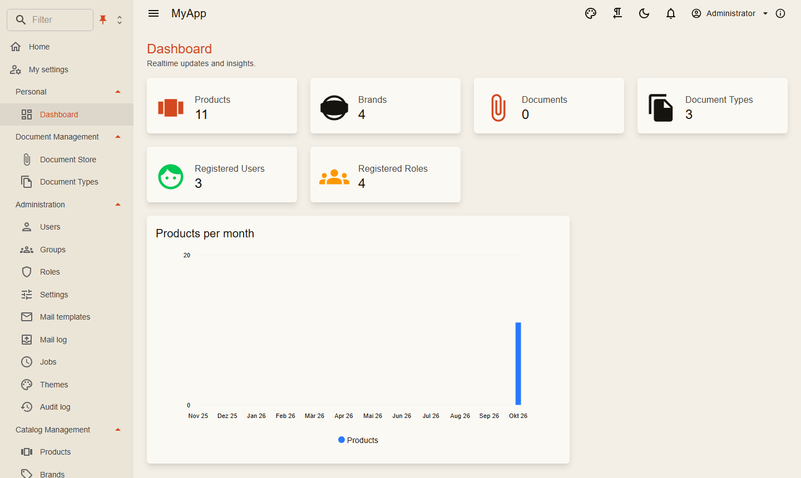
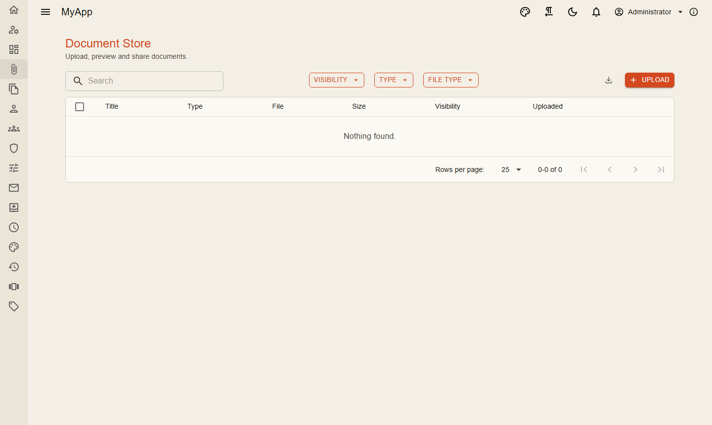
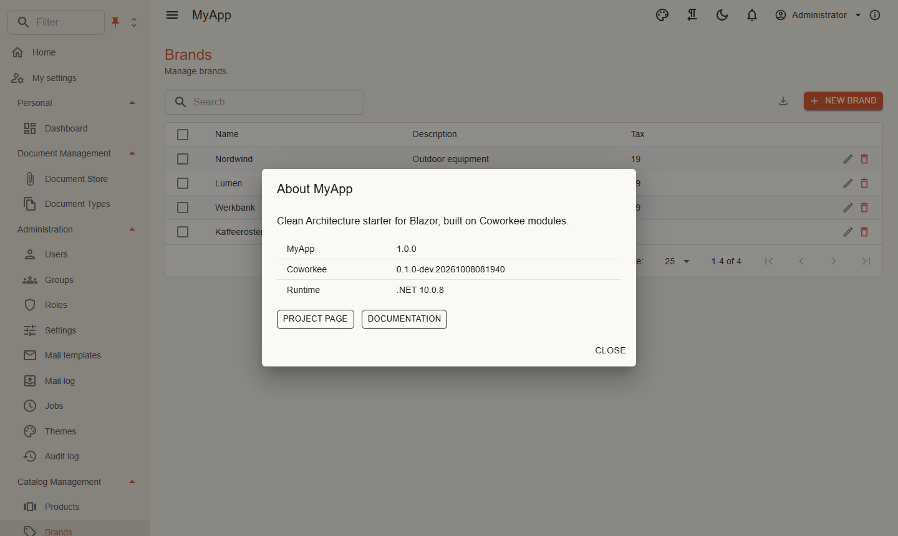

# Client and layout

`Coworkee.Client.Blazor` is a complete WebAssembly shell: layout, navigation, user menu, notifications, admin pages for users, groups, roles, settings, themes, mail templates, jobs and audit log. The app adds its pages and menu entries.

```csharp title="MyApp.Web.Client/Program.cs"
var builder = WebAssemblyHostBuilder.CreateDefault(args);
var baseAddress = new Uri(builder.HostEnvironment.BaseAddress);
builder.Services.AddCoworkeeClient(baseAddress, options =>
{
    options.AppTitle = "MyApp";
    options.AppDescription = "Clean Architecture starter for Blazor, built on Coworkee modules.";
    options.AboutLinks.Add(new AboutLink("Documentation", "https://fgilde.github.io/CoworkeeLib/"));
});
builder.Services.AddHttpClient<ICatalogApi, CatalogApi>(client => client.BaseAddress = baseAddress);
builder.Services.AddSingleton<INavigationContributor, MyAppNavigation>();
builder.Services.Configure<NavigationMenuOptions>(MyAppNavigation.Order);
await builder.Build().RunAsync();
```

```razor title="Routes.razor"
<Router AppAssembly="typeof(Program).Assembly" AdditionalAssemblies="new[] { typeof(CoworkeeClientOptions).Assembly }">
    <Found Context="routeData">
        <AuthorizeRouteView RouteData="routeData" DefaultLayout="typeof(CoworkeeLayout)" />
    </Found>
</Router>
```

{ .shot }

## Navigation

```csharp
internal sealed class MyAppNavigation : INavigationContributor
{
    private const string CatalogManagement = "Catalog Management";

    public static void Order(NavigationMenuOptions menu) => menu
        .OrderGroup("Personal", 0)
        .OrderGroup(NavigationGroups.Administration, 2)
        .OrderGroup(CatalogManagement, 3);

    public IEnumerable<CoworkeeNavItem> Items =>
    [
        new("Dashboard", "/dashboard", Icons.Material.Outlined.Dashboard, CatalogPermissions.Dashboards.View, Group: "Personal"),
        new("Products", "/catalog/products", Icons.Material.Outlined.ViewCarousel, CatalogPermissions.Products.View, Group: CatalogManagement),
        new("Brands", "/catalog/brands", Icons.Material.Outlined.Sell, CatalogPermissions.Brands.View, Group: CatalogManagement, Order: 1),
    ];
}
```

| `NavigationMenuOptions` | |
|---|---|
| `OrderGroup(name, order)` | position of a group; unknown groups come last, by name |
| `Hide(hrefs)` | removes entries, also the built-in admin pages |
| `ShowHome`, `HomeTitle` | the home link at the top |

Users can filter the menu, pin it or let it collapse to icons (it opens on hover), and choose whether one group or several stay open. The choice is stored in the browser.

{ .shot }

## App bar

The app bar shows the theme menu, right to left switch, dark mode, notifications, user menu and the about dialog. Add your own components:

```csharp
internal sealed class LanguageBar : IAppBarContributor
{
    public IEnumerable<AppBarItem> Items => [new AppBarItem(typeof(LanguageSwitch), Order: 10)];
}
```

{ .shot }

## Calling your API

Typed clients derive from `ApiClientBase`. It sends the CSRF header the BFF requires and turns problem details into `ApiException`:

```csharp
internal sealed class CatalogApi(HttpClient http) : ApiClientBase(http), ICatalogApi
{
    public Task<DashboardDto> GetDashboardAsync(CancellationToken cancellationToken = default) => GetAsync<DashboardDto>("api/v1/dashboard", cancellationToken);

    public Task DeleteBrandsAsync(IReadOnlyList<Guid> ids, CancellationToken cancellationToken = default) =>
        SendAsync(HttpMethod.Post, "api/v1/brands/delete", new IdsRequest(ids), cancellationToken);
}
```

`Snackbar.RunAsync(() => api.SaveAsync(...), "Saved")` runs a call and shows success or the validation messages of a failure.

## Building blocks

| Component | Use |
|---|---|
| `PageHeader` | title, description, actions on the right; sets the browser title |
| `PermissionGate`, `PermissionView` | render content only with a permission |
| `RealtimeSubscription` | calls back when the server publishes on a topic, e.g. `type:Brand` |
| `CoworkeeDataTable<T>` | [data tables](data-table.md) |
| `ShowEditAsync` | edit dialog generated from a model |
| `AuditTimeline`, `VersionHistory` | change history of an entity |
| `ResourcePermissionsPanel` | grants on a single resource |
