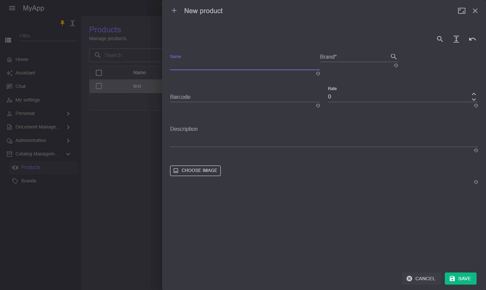

# Datentabellen

`CoworkeeDataTable<T>` ist ein MudBlazor-Datagrid auf einem [OData-Set](../web/odata.md). Der Server blättert, sortiert, filtert und zählt; die Tabelle ergänzt Suche, Facetten, Export, Auswahl und die Schaltflächen zum Anlegen, Bearbeiten und Löschen mit ihren Berechtigungen.

```razor
<CoworkeeDataTable T="ProductDto" EntitySet="Products" Expand="Brand" SearchFields="SearchFields" MultiSelection="true" ExportFileName="products"
                   CreatePermission="@CatalogPermissions.Products.Create" EditPermission="@CatalogPermissions.Products.Edit" DeletePermission="@CatalogPermissions.Products.Delete"
                   OnCreate="CreateAsync" OnEdit="EditAsync" OnDelete="DeleteAsync" DescribeItem="p => p.Name">
    <Columns>
        <PropertyColumn Property="p => p.Name" />
        <PropertyColumn Property="p => p.Brand!.Name" Title="Brand" />
        <PropertyColumn Property="p => p.Rate" Format="0.00" />
    </Columns>
</CoworkeeDataTable>
```

{ .shot }

| Parameter | |
|---|---|
| `EntitySet` | Name des OData-Sets |
| `Columns` | MudBlazor-Spalten; verschachtelte Eigenschaften sortieren als `Brand/Name` |
| `Expand` | zu ladende Navigationseigenschaften, z. B. `"Brand"` |
| `Filter` | ein fester OData-Filter zusätzlich zur Auswahl des Benutzers |
| `SearchFields` | Eigenschaften, in denen das Suchfeld sucht (`contains`, ohne Groß-/Kleinschreibung) |
| `Facets` | Facettenmenüs anzeigen (Standard `true`) |
| `MultiSelection` | Checkboxen und eine Schaltfläche *Delete n* |
| `OnCreate`, `OnEdit`, `OnDelete` | Callbacks; die Tabelle lädt danach jeweils neu |
| `CreatePermission`, `EditPermission`, `DeletePermission` | blenden die Schaltflächen ohne Berechtigung aus |
| `DescribeItem` | Text für die Löschbestätigung |
| `Exportable`, `ExportFileName` | CSV- und JSON-Export aller Zeilen des aktuellen Filters |
| `ToolBarContent` | zusätzliche Schaltflächen in der Werkzeugleiste |
| `PageSize` | Zeilen pro Seite (25) |

`ReloadAsync()` lädt von außen neu, etwa aus einer `RealtimeSubscription`. `Selection` liefert die Facettenauswahl, `CurrentFilter` den OData-Filter, den die Tabelle sendet.

Der CSV-Export entschärft Werte, die Tabellenkalkulationen sonst als Formel ausführen würden.

## Bearbeitungsdialoge

Für einfache Modelle reicht ein erzeugter Dialog:

```csharp
if (await Dialogs.ShowEditAsync("Edit brand", model) is { } saved)
{
    await Snackbar.RunAsync(() => Api.SaveBrandAsync(id, saved), "Brand saved");
}
```

Bearbeitungsdialoge sind Seitenblätter in voller Höhe, die von der Seite hereingleiten, auf die der Benutzer geklickt hat, auf breiten Bildschirmen zweispaltig. Mit `meta => ...` konfigurieren Sie das `MudExObjectEditForm` (Beschriftungen, Reihenfolge, Editoren). Mit einer Speicherfunktion bleibt der Dialog offen und zeigt die Meldungen der API, wenn das Speichern scheitert:

{ .shot }

```csharp
await Dialogs.ShowEditAsync(L["New product"], model, saved => Api.SaveProductAsync(id, saved), meta =>
{
    meta.Property(p => p.BrandId).WithLabel(L["Brand"])
        .RenderWith<ODataPicker, Guid>(p => p.Value)
        .WithAdditionalAttribute(nameof(ODataPicker.EntitySet), "Brands");
    meta.Property(p => p.ImageDataUrl).WithLabel(L["Image"]).RenderWith<ImageDataUrlEdit, string?>(p => p.Value);
});
```

| Editor | für |
|---|---|
| `ODataPicker` | einen Fremdschlüssel: sucht in einem OData-Entity-Set über eine Texteigenschaft |
| `ImageDataUrlEdit` | ein Bild, gespeichert als Data-URL |

`ShowSideSheetAsync<TDialog>` öffnet eine eigene Dialogkomponente genauso, `ConfirmAsync` fragt vor etwas, das sich nicht rückgängig machen lässt.

## Ansichten, URL und Spalten

- **URL**: Suche und gewählte Facetten stehen im Query-String (`?products=...`), eine gefilterte Liste lässt sich also neu laden, als Lesezeichen speichern und an Kollegen schicken. `UrlState="false"` schaltet das ab, `StateKey` benennt den Parameter, wenn eine Seite zwei Tabellen desselben Sets zeigt.
- **Gespeicherte Ansichten**: das Lesezeichen-Menü speichert Suche, Facetten und ausgeblendete Spalten unter einem Namen und stellt sie mit einem Klick wieder her. Ansichten liegen pro Browser.
- **Spalten**: das Spalten-Menü blendet Spalten ein und aus.

{ .shot }

{ .shot }

```razor
<CoworkeeDataTable T="ProductDto" EntitySet="Products" UrlState="true" SavedViews="true" ColumnChooser="true" ... />
```

`CurrentState` liefert, was die Tabelle zeigt, als `DataTableState`, zum Beispiel für eigene Links.
