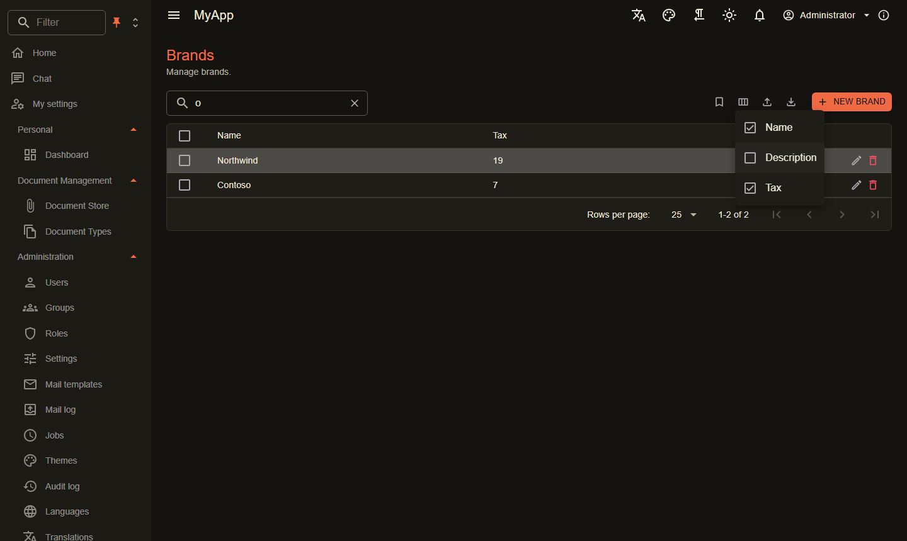
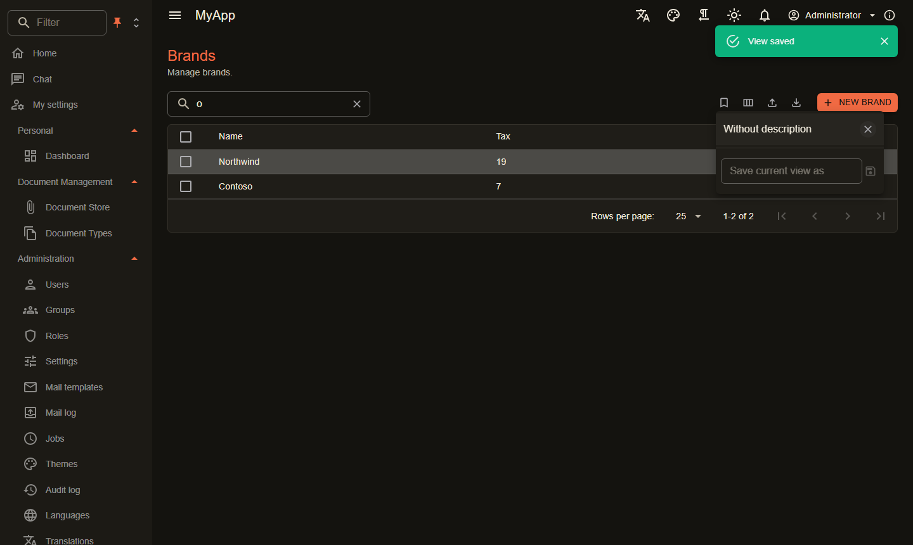

# Data tables

`CoworkeeDataTable<T>` is a MudBlazor data grid on top of an [OData set](../web/odata.md). The server pages, sorts, filters and counts; the table adds search, facets, export, selection and the create, edit and delete buttons with their permissions.

```razor
<CoworkeeDataTable T="ProductDto" EntitySet="Products" Expand="Brand" SearchFields="SearchFields" MultiSelection="true" ExportFileName="products"
                   CreatePermission="@CatalogPermissions.Products.Create" EditPermission="@CatalogPermissions.Products.Edit" DeletePermission="@CatalogPermissions.Products.Delete"
                   OnCreate="CreateAsync" OnEdit="EditAsync" OnDelete="DeleteAsync" DescribeItem="p => p.Name">
    <Columns>
        <PropertyColumn Property="p => p.Name" />
        <PropertyColumn Property="p => p.Brand!.Name" Title="Brand" />
        <PropertyColumn Property="p => p.Rate" Format="0.00" />
    </Columns>
</CoworkeeDataTable>
```

{ .shot }

| Parameter | |
|---|---|
| `EntitySet` | name of the OData set |
| `Columns` | MudBlazor columns; nested properties sort as `Brand/Name` |
| `Expand` | navigation properties to load, e.g. `"Brand"` |
| `Filter` | a fixed OData filter on top of the user's choices |
| `SearchFields` | properties the search box looks in (case insensitive `contains`) |
| `Facets` | show the facet menus (default `true`) |
| `MultiSelection` | check boxes and a *Delete n* button |
| `OnCreate`, `OnEdit`, `OnDelete` | callbacks; the table reloads after each of them |
| `CreatePermission`, `EditPermission`, `DeletePermission` | hide the buttons without the permission |
| `DescribeItem` | text for the delete confirmation |
| `Exportable`, `ExportFileName` | CSV and JSON export of all rows of the current filter |
| `ToolBarContent` | extra buttons in the tool bar |
| `PageSize` | rows per page (25) |

`ReloadAsync()` reloads from outside, for example from a `RealtimeSubscription`. `Selection` exposes the facet choices, `CurrentFilter` the OData filter the table sends.

The CSV export escapes values that spreadsheet programs would run as formulas.

## Edit dialogs

For plain models a generated dialog is enough:

```csharp
if (await Dialogs.ShowEditAsync("Edit brand", model) is { } saved)
{
    await Snackbar.RunAsync(() => Api.SaveBrandAsync(id, saved), "Brand saved");
}
```

Pass `meta => ...` to configure the `MudExObjectEditForm` (labels, order, editors). For lookups, uploads or anything custom write a dialog component, as the template does with `ProductDialog` and `DocumentDialog`.

## Views, URL and columns

- **URL**: search and chosen facets go into the query string (`?products=...`), so a filtered list can be reloaded, bookmarked and sent to a colleague. `UrlState="false"` turns it off, `StateKey` names the parameter when a page shows two tables of one set.
- **Saved views**: the bookmark menu saves search, facets and hidden columns under a name and brings them back with one click. Views are kept per browser.
- **Columns**: the column menu shows and hides columns.

{ .shot }

{ .shot }

```razor
<CoworkeeDataTable T="ProductDto" EntitySet="Products" UrlState="true" SavedViews="true" ColumnChooser="true" ... />
```

`CurrentState` returns what the table shows as a `DataTableState`, for example to build your own links.
