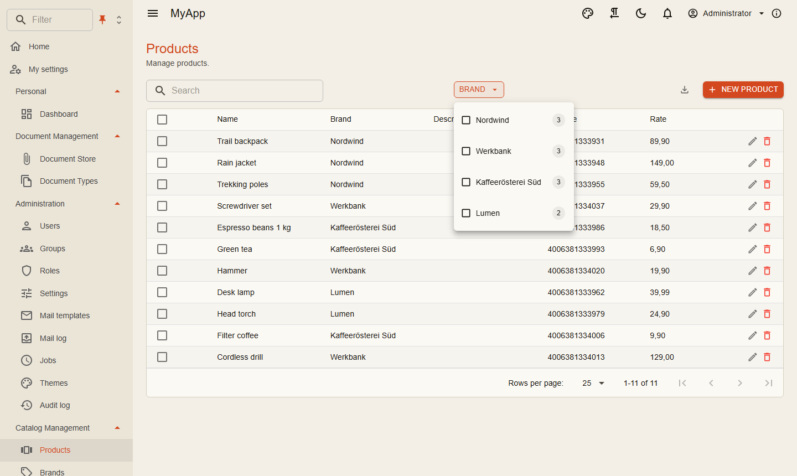

# OData und Facetten

Jede Entity wird mit einer Zeile zu einem OData-Set. Tabellen, Exporte und externe Werkzeuge lesen darüber; Listenabfragen schreiben Sie nicht.

```csharp
[DependsOn(typeof(CoworkeeODataModule))]
public sealed class MyAppCatalogModule : CoworkeeModule
{
    public override void ConfigureServices(ModuleServiceContext context)
    {
        context.Services.AddODataEntity<Brand>("Brands", CatalogPermissions.Brands.View);
        context.Services.AddODataEntity<Product>("Products", CatalogPermissions.Products.View);
    }
}
```

| Anfrage | Ergebnis |
|---|---|
| `GET /odata/Products?$filter=Rate gt 20&$orderby=Name&$top=25&$skip=50&$count=true` | eine Seite, Gesamtzahl |
| `GET /odata/Products?$expand=Brand` | Produkte mit ihrer Marke |
| `GET /odata/Products({id})` | ein Produkt |
| `GET /odata/Products?$select=Name,Rate` | nur diese Spalten |

Die Berechtigung des Sets wird bei jedem Aufruf geprüft, Mandanten- und Soft-Delete-Filter gelten wie überall. `$top` ist auf 1000 begrenzt (`Coworkee:OData:MaxTop`); ungültige Abfragen beantworten `400` mit Problem Details.

## Facetten

Markieren Sie die Eigenschaften, nach denen Benutzer filtern sollen:

```csharp
using Nextended.Core.Facets;

public sealed class Product : AuditedEntity, IMultiTenant
{
    [ProvideFacet(Label = "Brand", ValuePath = "BrandId", LabelPath = "Brand.Name", ValueType = typeof(Guid))]
    public Guid BrandId { get; set; }

    public Brand? Brand { get; set; }
}
```

Fragt der Request mit `Prefer: odata.include-annotations="cn.facets"` danach, enthält die Seite die Facettengruppen unter `@cn.facets`: jede Option mit Beschriftung, Anzahl und dem OData-Filterfragment, das sie setzt. Die Zahlen folgen dem aktuellen Filter, wie man es von Shop-Filtern kennt. [`CoworkeeDataTable`](../ui/data-table.md) zeigt sie als Menüs mit Checkboxen; Optionen einer Gruppe werden mit *oder*, Gruppen mit *und* verknüpft.

{ .shot }

## Regeln pro Zeile

Manche Zeilen sind nicht für alle. Ein Entity-Filter schränkt Listen, Zähler, Facetten und Einzelabfragen gleichermaßen ein:

```csharp
internal sealed class DocumentODataFilter(DocumentVisibility visibility) : IODataEntityFilter<Document>
{
    public Task<IQueryable<Document>> ApplyAsync(IQueryable<Document> query, CancellationToken cancellationToken) =>
        visibility.VisibleAsync(query, cancellationToken);
}

services.AddScoped<IODataEntityFilter<Document>, DocumentODataFilter>();
```

## Eigenschaften ausblenden

Interne Felder bleiben aus dem Modell, sie werden weder ausgeliefert noch sind sie filterbar:

```csharp
services.AddODataEntity<Document>("Documents", DocumentPermissions.Documents.View, d => d.BlobKey);
```

## Aus dem Blazor-Client

`IODataClient` baut die URL und liest Werte, Anzahl und Facetten:

```csharp
var page = await odata.QueryAsync<BrandDto>("Brands", new ODataQuery { OrderBy = "Name", Top = 1000, Count = false });
```

Der BFF leitet `/odata` mit dem Token des Benutzers an die API weiter.

## Excel-Export und -Import

Jedes Entity-Set lässt sich als Excel-Arbeitsmappe exportieren. Der Export nimmt dieselben `$filter`, `$search` und `$orderby` wie die Liste und beachtet Berechtigung, Entity-Filter und ausgeblendete Eigenschaften:

```http
GET /api/v1/data/Products/export?$filter=Rate gt 10&$orderby=Name
```

Die Zeilenzahl begrenzt `Coworkee:OData:MaxExportRows` (Standard 100 000).

Ein Import macht aus jeder Zeile einer hochgeladenen Tabelle einen Command. Spalten werden per Name auf Eigenschaften abgebildet, unbekannte Spalten ignoriert. Jede Zeile läuft einzeln durch die Pipeline, Validierung und Berechtigungen gelten also; fehlerhafte Zeilen kommen mit ihrer Zeilennummer zurück:

```csharp
// Zeilen sind der Request-Typ, das Lambda verpackt sie in den Command
services.AddODataImport("Brands", (AddEditBrandRequest row) => new AddEditBrandCommand(null, row));

// oder der Command selbst ist die Zeile
services.AddODataImport<AddNoteCommand>("Notes");
```

```http
POST /api/v1/data/Brands/import   (multipart, Feld "file")
-> { "imported": 12, "errors": [ { "row": 7, "message": "Name: must not be empty" } ] }
```

[`CoworkeeDataTable`](../ui/data-table.md) bietet beides: *Excel* im Export-Menü und einen Import-Button mit `Importable="true"`.
